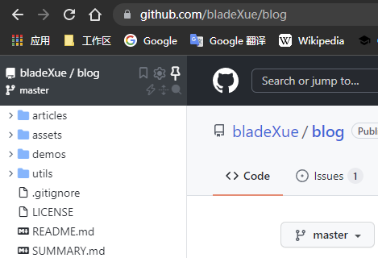

# 读文须知

> 本博客迁移自我的旧文章合集，可能还有一些问题没解决，请见谅。

[文章目录](SUMMARY.md)来自`SUMMARY.md`文件，提供了每篇文章的地址，分类，进度和简介。

原文都存放在`\articles\`目录下，子目录名称`xxxx\`为文章名，文字部分以`markdown`形式存放在`READEME.md`中，博文目录下的`info.json`记录文章信息，并提供给生成器在目录中生成文章词条。文章涉及或引用的类似代码，图片和音频等资源都会直接放在相同目录下。由于目前`\articles\_drafts\`目录下也存放了很多未完成的草稿，具体文章列表还是以`\SUMMARY.md`中的清单为准。

`\assets\`目录存放着一些公共资源，比如图片和头像，`\demos\`目录存放一些案例，`\utils\`目录存放一些如生成博文目录的工具脚本，这几个目录和阅读没有直接关系无需关心。

！！！博文内容可能包括**出版物的摘录**，开源项目的**代码片段**，各类**技术博文的参考**等，如有*侵权现象*发生，请issue或者邮件call我，如果你发现了文章的错误或者改进，同样可以联系我。我希望我的博文能分享我的知识，而且文章是简洁且易读的，但是句子总是写得很啰嗦找不到重点，如果觉得文章有些拖泥带水表意不清，请在issue里指出，帮助我改进，感谢你们的支持。

## 往期文章推荐

> 作者很懒，只推荐了2篇。

- [x] [Git小魔术](articles/git/git-tricks/) `git`   收录一些常用的Git片段
- [ ] [Emacs：最好的Python编辑器？](articles/emacs/emacs-the-best-python-editor/) `emacs`  `python`  `翻译`   

## 阅读插件

> 为了增加阅读体验，建议安装[Octotree Code Tree](https://www.octotree.io/)这个Chrome插件，它会在浏览器左侧生成GitHub仓库的目录树。

## 推荐阅读

文章：

1. [How to Design Programs](https://htdp.org/)
2. [SQlite源码分析](http://huili.github.io/)

书单：

1. [计算机程序的构造和解释](https://book.douban.com/subject/1148282/)
2. [代码里的世界观](https://book.douban.com/subject/30402683/)

## 友情链接

- [Matrixzj](https://www.cnblogs.com/matrixzj/)
- [Lebenito](https://blogs.lebenito.net/)
- [WarrenRyan](https://www.cnblogs.com/warrenryan)
- [无锡肖奈](https://segmentfault.com/u/wuxixiaonai)
- [粟米](http://www.dreamingcat.me)
- [Rrafa](http://rrafa.icu/mt-blog/)
- [Aissen](http://q-minr.top/) `建设中`
- [竹青](https://www.tardblog.cn/)
- [莉莉娅](https://liliya.top/)

## 关于作者|･ω･｀)

研究生在读，目标是成为六边形战士。

## 作者的碎碎念

- 不要fork本仓库，评论可以直接issue，引用请标注出处。
- 本仓库已修改为`cc`许可证。
