# 图结构的基本概念，定理和问题

> 图结构是计算机中最重要最复杂的一类数据结构
> 本篇重点讲解图论的基本概念，建立起对图结构的直观看法
<!-- more -->
#### 阅读之前

本文是系列文章的其中一篇，关于前后文请参见[图论专栏-导读](https://bladexue.github.io/2020/08/25/algorithm/data-structure/graph-theory-guide/)

#### 什么是图

在很多计算机应用里，由相连的结点所表示的模型起到了关键的作用，这一类模型通常由多对多关系组成，其背后的抽象结构就是图。图结构是一种非常重要的数据模型，往往直接和现实世界的问题模型相关联，图论算法是数据结构算法中的精粹，是解决许多重要的实际问题的基础

图论最初被人关注的问题很简单，当我们将个体抽象成一个个相连接的结点后，自然而然产出了一系列问题：通过这些连接能否从一个结点到达另一个结点？有多少结点和指定结点相连？两个结点中最短的连接是哪一条？

有意思的是，这些看似非常简单的问题恰恰构成了图论算法的核心，当我们深入学习图论算法后，会发现这些算法其实都很简洁，且结构性很强，图论算法的代码通常很短但是很有意思

下表给出了图结构的一些典型应用：

|   应用    |                             描述                              |   结点   |   连接   |
| --------- | ------------------------------------------------------------ | ------- | ------- |
| 地图      | 公路网是典型的图，最出名的就是最短路径算法                        | 交叉路口 | 公路     |
| 网络内容   | 各个网站之间的超链接指向形成了一张图                             | 网页     | 超链接   |
| 电路      | 电路的元器件连通走向                                            | 元器件  | 导线     |
| 任务调度   | 内核的CPU任务往往有前驱性，可以形成前驱图                         | 任务     | 限制条件 |
| 商业交易   | 在信息化交易体系中，图可以表示各个产品的资金流向，帮助投资人理清关系 | 客户     | 交易     |
| 配对      | 学生可以申请加入机构                                            | 学生     | 申请     |
| 计算机网络 | 类似公路问题，网络算法总是希望找到最快的路径来传递报文             | 网站     | 物理连接 |
| 软件      | 最著名的问题恐怕是循环依赖了，利用的就是图的环路问题               | 方法     | 调用关系 |
| 社交网络   | 朋友网络是一种图，大型公司通常是用这个图来进行好友推荐             | 人       | 友谊关系 |

#### 认识图论：从一个想过河的人说起

前文说过，很多现实问题，都可以抽象成有关的数学集合和二元关系问题，这里我举一个经典的“人狗羊菜问题”（又称过河问题）为例，就是说一个人带着一只狗，一只羊和一捆菜准备过河，但是河上只有一只小船，承重有限，人每次过河只能带一样东西，但是：

- 不能把狗和羊同时单独留在一边（狗会吃掉羊）
- 不能把羊和菜同时单独留在一边（羊会吃掉菜）

问：找到一个策略，将人狗羊菜都带到河的另一边且不损失任何物件？

在这个问题中，我们拥有4个实体对象，也就是人，狗，羊和菜，我们建立一个二元集合(X,Y)，也就是对于(人狗羊菜,0)表示人狗羊菜都在岸的一边，有人看着相安无事，这一个称为“合法局面”，而另一边是空的，如果是(人狗,羊菜)则表示一边是人狗，另一边是羊和菜，羊吃掉了菜，方案失败，这个称为“非法局面”，除此之外的合法局面还有(0,人狗羊菜)，(人羊,狗菜)，(菜,人狗羊)等等，**如果两个合法局面之间可以直接转换，那我们就画一条边**，表示它们有直接关系R，由于R是对称的（A->B等价于B->A），所以使用直线连接而不是箭头，于是获得下图：

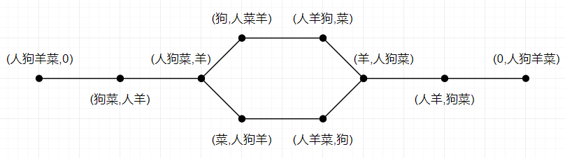

> 本题这个图又叫“局面转移图”，或者“状态转移图”

观察这个图形，不难发现，图的左右两端是我们问题的起点和终点，只要沿着左端，按照沿路结点的顺序来运送物件，就可以成功运送物件到河岸且无损失（也就是从图的左端点，到图的右端点）。同时观测到这个方案其实有两个，选择哪个都可以解决这个“人狗羊菜”问题

至此我们利用图论解决了第一个问题，想必对图论也有了一个较为直观的感受，其实不难看出，应用图论模型来解决问题其实有一定的步骤：

1. 建立顶点集：根据问题，建立合适的顶点集，顶点往往代表一个状态或者实体
2. 建立边集：在顶点集的基础上，根据条件限制，确认边集（顶点之间的关系，边是关系的具象化）
3. 建立有效模型：在顶点集和边集的模型基础上，并尝试讨论该图是否一些具体性质，如连通性（A点和B点是否有可达通路），优化路径（A点到B点有多条路时是否有一条路比其它路短）
4. 输出有效数据：根据图论拥有或者可能拥有的性质，建立算法步骤，获得解决问题需要的具体数据，如A点和B点若连通，输出其具体的沿途路径，若有可能多条路径，输出路径数目 

> 值得注意的是，实际应用中，图论问题往往是某个复杂问题的子问题（如正则的FSM最后其实就是图的顶点可达性问题），步骤可能不完全一致，但是要点都是一致的

> 在上文的人羊狗菜问题中，我们也可以看到，一个图形，可能拥有众多特性，如短视性（每个顶点只能和直接相连的顶点移动），选择性（可用方案往往有多个）和对称性（A可到B，则B可到A），讨论这些性质的有无是一个图的重要内容，也是下节的重点

#### 图的重要概念

图结构在应用时种类繁多，尤其灵活，仅凭上节的粗糙模型是无法完整描述并解决图论问题的，必须使用正确严谨的逻辑语言对其进行描述。图的概念众多，基本概念主要分为3类：

1. 点边模型
2. 路径和连通性
3. 子图

> 图论原本是数学分支，详细之处还请参考严谨离散数学教材，我这里仅作数据结构方面的解释

###### 图的集合定义

设一个图为```G```，由顶点集```V```和边集```E```组成，记为```G=(V,E)```，其中```V(G)```表示图```G```中顶点的非空有限集，```E(G)```表示图```G```中顶点之间的关系（边）集合，每个关系（边）都是一个有效的顶点对。对于一个图```G```，若```V={v1,v2,v3 ...}```，其顶点数目为图```G```的阶，记作```|V|```，且有```E={(u,v)|u∈V,v∈V}```，记作```|E|```为该图的边数

> 线性表和二叉树都可以为空，但是图**不可以为空**（此处指顶点集必须非空，因为顶点代表实体，但是边集可以非空，也可以空，此时图只有结点没有边）

###### 图的有向性

前文提到，边是图中顶点的一个二元关系，在形式上表示为一个二元关系```{v,w}```，其中v和w是否表达先后关系决定图是否有向


当图```G```为**有向图**时，边为有向边（或者**弧**），有向边是顶点的有序对，记为```<v,w>```，作图为箭头，且```<v,w>≠<w,v>```。对于```<v,w>```，其中v和w是顶点，其中v称为弧尾，w称弧头，```<v,w>```称从顶点v到顶点w的弧，其表示```v->w```的一条**有向**边，表达上称**v邻接到w**或者**w邻接自v**

设有向图```G1=(V1,E2)```表示有```V1={1,2,3}```和```E1={<1,2>,<2,1>,<2,3>}```，则有作图：

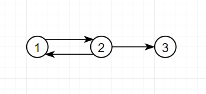

当图```G```为**无向图**时，边为无向边（简称**边**），无向边是顶点的无序对，记为```(v,w)```，作图为直线，且```(v,w)=(w,v)```。对于```(v,w)```，其表示等价于```(w,v)```，其中v和w是顶点，其中v和w称互为邻接，边```(v,w)```依附于顶点v和w，其表示```v<->w```的一条**无向**边

设无向图```G2=(V2,E2)```表示有```V2={1,2,3,4}```和```E2={(1,2),(1,3),(1,4),(2,3),(2,4),(3,4)}```，则有作图：
 
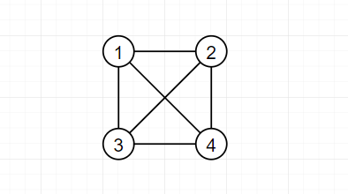

图的**有向性**其实表示了顶点之间关系的一些限制，比如当你表示地铁站的布局图时，闸机就是一个单向通行的路径，形式上是有向图路径，其**通行是单向的**，表示家族谱系时同样，每个人只有一个父亲。在数据结构的表示上，其实单链表是一个有向图，每个结点只有一个后驱指针，其只能指向一个后驱结点，并被一个前驱结点指向，双向链表则是一个无向图，既有后驱指针也有前驱指针，每对相邻结点都是互相指向的，所以从结构上来看，**无向图其实是一个特殊的有向图**（每两个连通的结点都有两条弧，一来一去），但是在实际讨论时，我们还是分开来的，可以避免一些细节问题，但是在本质上我们要明白，其实它们区别不大，甚至相当多算法的无向图版本和有向图版本，代码都可能长一样

###### 简单图和完全图

当图```G```满足：

1. 不存在重复边
2. 不存在顶点到自身的边

则称该图为**简单图**，非简单图称**多重图**。数据结构中不加说明，默认只讨论简单图

> 简单图有形式简洁性，当我们讨论苏州是否可以到南京时，你有1条路还是20条路关我p事，然后你告诉我还有条路能出了苏州城绕城门一圈回到苏州？？？

当无向图满足，任意两个顶点之间都存在边时，称**无向完全图**（完全图又称简单完全图，简单性是完全性的前置条件），含有n个顶点的无向完全图有```0.5*(n-1)*n```条边。当有向图满足，任意两个顶点之间都存在方向相反的两条弧时，称**有向完全图**，含有n个顶点的有向完全图有```(n-1)*n```条弧

一个无向完全图和一个有向非完全图：
 
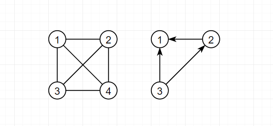

###### 顶点的度和边权

度是衡量图中顶点交流性的指标（顶点相连的边越多，交流性越强）。对于无向图来说，某顶点的度其实就是其拥有的边的数目，记作```TD(v)```，假设某无向图有n个顶点和e条边，有```∑TD(v)=2*e```，也就是无向图所有顶点的度之和等于边数的2倍。对于有向图来说，某顶点的度分为出度```OD(v)```和入度```ID(v)```，假设某有向图有n个顶点和e条边，有```∑ID(v)=∑OD(v)=e```，也就是无向图所有顶点的出度之和等于入读之和，数值为边数

> 一般来说，当图```G```满足```|E|<|V|*log(|V|)```时，称稀疏图（也就是点多边少），反之称稠密图（点少边多），这在算法选型时很重要，因为部分算法在稀疏图上性能好，另一些在稠密图上性能好

在一些图中，边可以拥有一个具有某种意义的数值，该数值称该边的权值，该边称带权边，这个图称为**带权图**，又称**网**。通常来说，边的权代表了通过这条边所需要的“代价”

###### 路径和连通性

在直观上，图就是一堆互相连接的点，用来表示某个现实模型，我把之前“人狗羊菜”的图改动了一下：
 
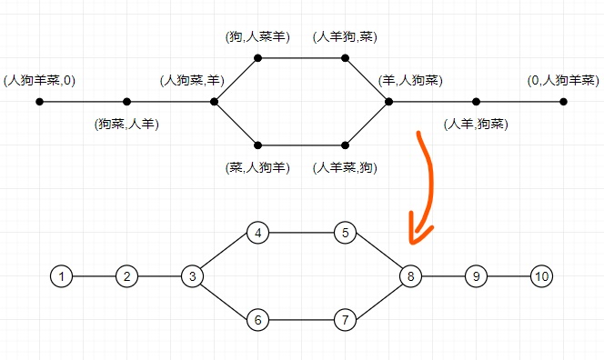

> 顶点v1到顶点vn的一条**路径**（或者**通路**）是指顶点的可通过序列\[v1,v2...vn]，路径上**边**的数量称**路径长度**。顶点之间的最短路径长度称**距离**。当路径的起点和重点重叠时，称该路径为**回路**或**环**（形态上会形成一个圈，上图的```{3,4,5,6,7,8}```就是一个回路）

> 环路判定定理：若一个图有n个顶点且边数>n-1，则该图必存在回路

在“人羊狗菜”问题中，我们把原本过河的逻辑问题，转换成了顶点1到顶点10的可达性问题，像这种在无向图中，如果顶点v到顶点w有路径存在，则称v和w是连通的，在本例中顶点1到顶点10拥有两条路径。如果图```G```中任意两个顶点是连通的，则称图```G```是**连通图**，反之为**非连通图**。我们的“人狗羊菜”的就是一张连通图，也就是所有的点都连在了一个主体里，但是有时候会出现这样一种情况，有一个点“脱离”了图的主体，成为了一个不和任何点连通的“孤独”的顶点，这就称作**孤点**，下图中的顶点6就是一个孤点：
 
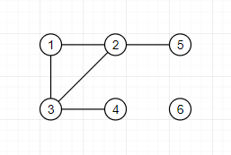

> 孤点存在定理：若一个图有n个顶点且边数<n-1，则该图必是非连通图（换言之，存在孤点）

注意，连通性是无向图的概念，有向图有个类似的性质，叫做**强连通性**，在有向图中，如果从顶点v到顶点w和从顶点w到顶点v都存在路径，那么称这两个点是强连通的，任意两个结点都强连通的有向图称**强连通图**

图的连通性和强连通性是一个图论核心性质，从数学结构上来说，连通性和强连通性都是一种[等价关系](https://zh.wikipedia.org/wiki/等价关系)，从直观上来说就是所有顶点之间都“**有来有回**”，从算法上讲，拥有连通性/强连通性的图，**掌握了其中一个顶点，就可以掌握其中所有的顶点**，就拿有向图来说，强连通性确保“数据的循环流动”，举个例子，有个金融分析师要研究最近十年的市场资金流动，他分析了12家公司的财务报表：
 
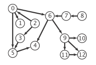

发现这根本不是一个强连通图，也就是说资金无法像生态循环一样在市场持续流动，而是最终进了4公司，10公司和12公司，这就不是一个健康的市场流动，而那这几家公司就很有可能是洗钱大户或者垄断联盟。这种问题很常见，同样的问题也可能发生在旅游过程中，很多景点之间只有单向车次，所以如果交通布局不是强连通的，很可能就出现你坐车去，结果玩了几个景点，最后要走路回来，可以说，**连通性**和**强连通性**保证了图的“**连通健康**”

> 值得注意的是，和简单图一样，我们讨论的所有路径和回路，都是**简单路径**（路径中顶点不重复出现）和**简单回路**（除顶点自叠外，无重复顶点）

###### 子图和连通分量

设有两个图```G=(V,E)```和```G'=(V',E')```，若```V'```是```V```的子集且```E'```是```E```的子集，则称```G'```是```G```的子图。如果```G'```是```G```的子图，且```V(G')```=```V(G)```，则称```G'```是```G```的**生成子图**（只删边，不删点）

子图是一个图的重要概念，回到之前提到的连通性问题，不是所有图都是连通图，观察下面的无向图```G```：
 
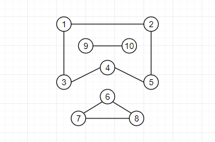

使用我们上文的连通性定义，可以清晰看到这个无向图中有3个“**孤岛**”，也就是```{1,2,3,4,5}```，```{6,7,8}```和```{9,10}```，在它们各自内部保证了连通性，成为了一个独立于整体的小“连通图”，像这一类无向图中的**极大连通子图**称为**连通分量**。本例的无向图拥有3个连通分量：
 
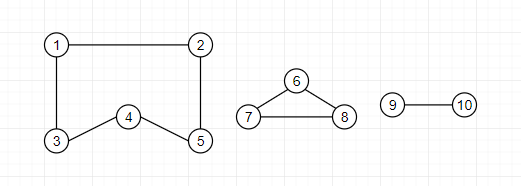

> 值得注意的是，极大联通子图在是```G```的子图的同时，要包含该“孤岛”内尽可能多的边，不然只能是连通子图，而不是极大连通子图。同样的概念还有极小联通子图，在保证子图连通性的同时，包含尽可能少的边

子图在图论中有很重要的应用，尤其是生成子图和生成树，再处理复杂图时，是一个很重要的简化和分析工具，就比如你遇到这么样一个迷宫问题：
 
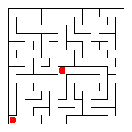

其实你很难一次性看出这个迷宫是不是整体相连的（连通图），有可能出现几条路是自闭的，不和主路相连，提前采取连通性分析可以少走弯路，如果发现自己的起点就是在一个不包括出口的自闭路径里（连通分量），那就直接放弃就行了，免得无用功

> 既然无向图有连通分量，那自然同样的概念也发生在有向图中，有向图```G```的**极大强连通子图**称为该有向图的**强连通分量**。定义类似不多赘述

#### 树和图的关系

> 本节默认你对树有所了解，知道树的基本概念和形态即可

首先来看一下数据结构的分级：

- 一对一关系：线性表（背包，栈和队列）
- 一对多关系：树（一般树和二叉树）
- 多对多关系：图（有向图和无向图）

从形态上讲，树其实是一种特殊的图，这里给出了5个顶点的2种边集组合，分别构成了树A和图B：
 
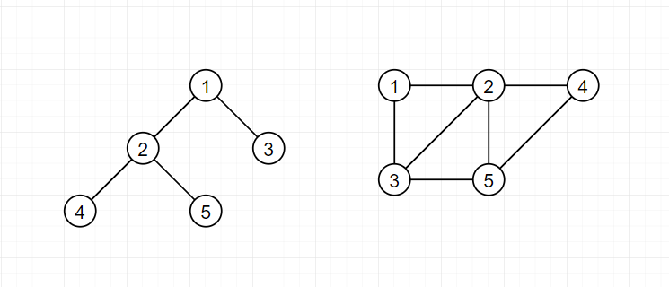

可以从形态上清晰看到，我们的树A其实就是图B的一个**生成子图**（只删边不删点的子图，见上文定义），生成子图是一个很常用的工具，它在保证连通图的顶点完整性和连通性的同时，不断删除多余的边，来减少边集冗余，当边数删到极限了，图就退化成一棵树，这棵树就称为连通图的**生成树**，它是包含图中**全部顶点**的**一个极小连通子图**

若连通图的顶点数为```n```，则它的生成树含有```n-1```条边，且对生成树而言：

- 删去一条边，它就会变成非连通图
- 加上一条边，则会形成环路

在非连通图中，各连通分量的生成树构成了非连通图的**生成森林**：
 
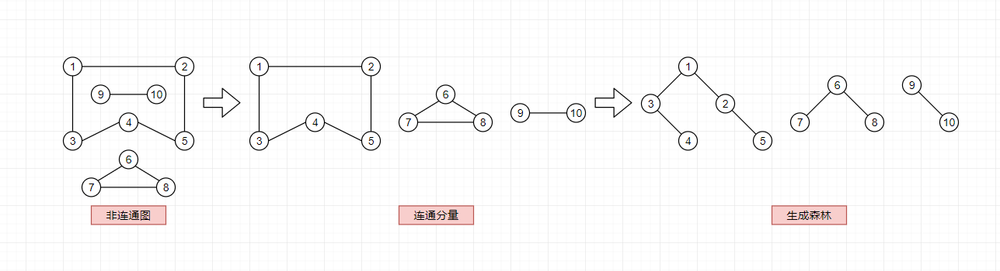

一个顶点的入度为0，其余顶点的入度均为1的有向图，称为**有向树**。同样是5个顶点，下图构造了一棵有向树和一个有向图：
 
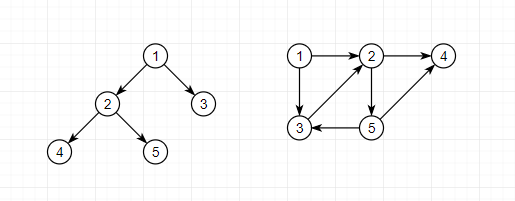

可以看到上图的有向树其实是有向图的一个**生成子图**

> 我们通常只在无向图中讨论生成树，有向树和生成树定义类似，但不是同一个感念（不是有向图的生成树），不要混淆

生成树和生成子图问题是很常见的一类图论问题，其核心在于“保证顶点集的完整性同时，减少边的数目”，经常用于一些需要“压缩时间和空间成本”的场合。举个例子，苏州市要修地铁了，但是地铁造价昂贵，市政府希望规划的几条线路能覆盖尽可能多的重要交通点（比如苏州火车站，观前街和市立医院），保证这些地点**连通**的同时，减少需要修建的地铁线，这个时候，设计师会将所有的比如30个站点先在地图上画出来，构造一个无向完全图，然后针对地区造价和施工难度，不断删除多余的边，最后获得一个接近**生成树**的**生成子图结构**，保证了地区**连通性**的同时，减少了建造成本。苏州市轨道交通布局图：
 
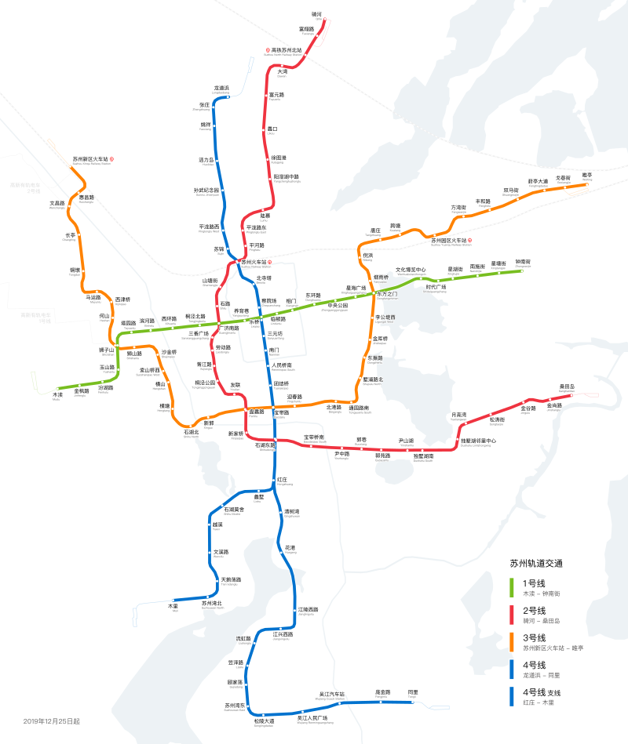

#### 图的数学表示法

矩阵表示法是图论的数学表示，之前我们看见的都是图例，属于图形表示法，优点是直观，但是没有数学结构，无法被计算机理解，矩阵表示法就是可以表示一个图的最早的可用数学模型

这里先给出有向图A和无向图B的图例（图形表示法）：
 
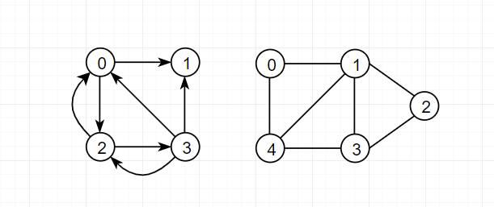

> 对于有向图A：```V={0,1,2,3}```且```E={e1=<0,1>,e2=<0,2>,e3=<2,0>,e4=<2,3>,e5=<3,0>,e6=<3,1>,e7=<3,2>}```

> 对于有向图B：```V={0,1,2,3,4}```且```E={e1=(0,1),e2=(0,4),e3=(1,2),e4=(1,3),e5=(1,4),e6=(2,3),e7=(3,4)}```

###### 关联矩阵法

对于一个图```G=(V,E)```，构造一个```n*m```的矩阵```M```，使得：

1. ```|V|```=```n```
2. ```|E|```=```m```
3. ```M(i,j)```=```1```，表示顶点```vi```和边```ej```有关联
4. ```M(i,j)```=```0```，表示顶点```vi```和边```ej```没有关联

那么称这个```n```行```m```列的矩阵```M```为图```G=(V,E)```的**关联矩阵**。上文图例中有向图和无向图的关联矩阵表示：
 
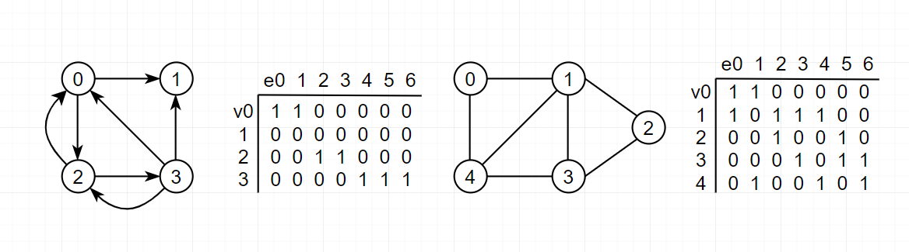
 
> 可以看到关联矩阵表示法其实蛮蛋疼的，有大量的数据空白，对于计算机来说利用率很低

###### 邻接矩阵法

对于一个图```G=(V,E)```，构造一个```n*n```的矩阵```M```，使得：

1. ```|V|```=```n```
2. ```M(i,j)```=```1```，表示顶点```vi```和```vj```有邻接
3. ```M(i,j)```=```0```，表示顶点```vi```和```vj```没有邻接

那么称这个```n```行```n```列的矩阵```M```为图```G=(V,E)```的**邻接矩阵**。上文图例中有向图和无向图的邻接矩阵表示：
 
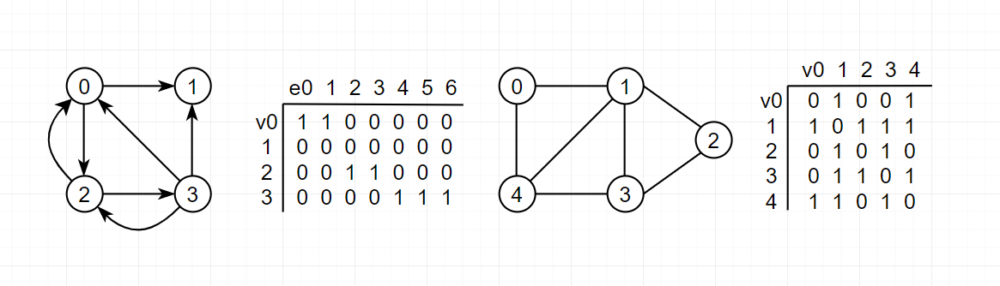

> 邻接矩阵很适合计算机存储，是常用方案之一

###### 矩阵压缩

观察邻接矩阵法所表示的无向图，其实会发现它是沿方阵对角线对称的，所以在实际操作时，可以只存储它的**上三角阵**或者**下三角阵**，必要时可以将其压缩成一个一维向量，在之后讲图论存储结构的博文里会有描述，本篇不作详解

#### 几个特殊的图和图论的主要问题

文章一开始就提过，图结构往往反应的是现实问题，所以图的种类千变万化，除了本文列举的几个基本概念外，有很多特殊图，都是针对不同问题出现的特殊结构，篇幅有限不作详解，仅仅罗列一下常见的，之后讲解相关问题的博文里会专门补充，这里混个眼熟即可：

- [欧拉图](https://zh.wikipedia.org/wiki/%E4%B8%80%E7%AC%94%E7%94%BB%E9%97%AE%E9%A2%98)
- [哈密尔顿图](https://zh.wikipedia.org/wiki/%E5%93%88%E5%AF%86%E9%A1%BF%E5%9B%BE)
- [正则图](https://zh.wikipedia.org/wiki/%E6%AD%A3%E5%89%87%E5%9C%96)
- [二分图](https://zh.wikipedia.org/wiki/二分图)

> 详细内容现已并入[我的图论专栏](https://bladexue.github.io/2020/08/25/algorithm/data-structure/graph-theory-guide/)

#### 总结

本篇作为入门篇，主要介绍了图论作为数据结构的主要概念，大部分都是概念的描述，详细定义并分别这些概念，是学习图论的重要步骤（免得以后题目都看不懂），这其中的概念主要有3个：

- 点边模型：了解图结构在数学上的集合本质，了解顶点集和边集是图的必要组成部分，并判断图的有向性，建立度和权的概念
- 路径和连通性：连通性是图的最**核心**特征，连通的图在算法上才有意义，路径问题是图论算法的一个大块
- 子图：图通常是一个拥有数百万结点的大型结构，子图可以很好的简化复杂图，树图转换也是一个很重要的图论算法

本篇提及的概念都很基础，是必须掌握的，尤其是几个判定定理，在之后的算法中，通常会起到关键作用（如环路判定定理在循环依赖检查算法中非常有用）。希望我提的例子能帮你开始理解图这种结构，建立起良好的直观，篇幅较长，写作匆忙，勘误还请issue或者直接评论指出

#### 参考

[wiki-图论](https://zh.wikipedia.org/wiki/图论)
[Algorithms, 4th Edition](https://algs4.cs.princeton.edu/home/)
[离散数学](https://item.jd.com/11658913.html)
[数据结构](https://item.jd.com/12793968.html)
