# 图的常见存储结构和封装

> 图的存储是这类数据结构的算法基础，又称物理结构，针对不同类型的图有不同的存储方案
> 在面向对象语言中，图可以通过封装来隔离各种存储结构以适应不同的场景，良好的存储结构封装是图算法的基础
<!-- more -->

#### 阅读之前

本文是系列文章的其中一篇，关于前后文请参见[图论专栏-导读](https://bladexue.github.io/2020/08/25/algorithm/data-structure/graph-theory-guide/)

#### 概念

> 所谓存储，就是设计一个结构，完整表示一个数据集

作为一种数据结构，如果想把图和其它的抽象数据结构（也就是ADT）来使用，就必须将其表示成某种有效的形式，也就是图的存储结构。按照离散数学中对图的定义形式```G=(V,E)```，想要设计一个存储结构来表示一个图的完整数据，就必须完整且准确地反应**顶点集**和**边集**的信息。由于图的结构多样，针对不同的使用场景，会出现不同类型的图（如构造高铁线路多用稀疏图，而网站拓扑多是稠密图），可以采用不用的存储方案，而且在实际使用中，不同的存储结构对程序的效率有较大影响，所以必须根据真实问题，调整所选用的存储结构

一般来说，无论是有向图还是无向图，其主要的存储方式只有两种：

1. 邻接矩阵
2. 邻接表
> 邻接矩阵属于图的顺序存储结构，邻接表属于链式存储结构

在此基础上，针对无向图和有向图的区别，对普通邻接表进行优化，可以得到两种新的数据结构，也就是**十字链表**和**邻接多重表**，这4种结构成为了图的基本存储结构

#### 图的存储结构

> 如果不带特殊说明，我们讨论图论问题时，说的都是简单图，也就是不带自旋和平行边的图
> 本文部分地方混淆了边和弧的释义，一般来说，有向边称弧，无向边称边

###### 1. 邻接矩阵

上文提过了，图```G=(V,E)```由一个**顶点集**和**边集**同时构成（不熟悉的旁友戳这里[图的数学定义](https://zh.wikipedia.org/wiki/图_(数学))），所谓的邻接矩阵存储法，就是用一个**一维数组**存储图中的**顶点**信息，用一个**二维数组**存储图中的**边**信息（也就是各个顶点直接的邻接关系），存储顶点之间邻接关系的二维数组称为**邻接矩阵**，邻接矩阵同时也是数学上表示图论的最初方法（详见离散数学和矩阵论）

矩阵的构造有3点规则：

1. 如果图有n个顶点，就构造一个n*n的二维数组map
2. 如果第i个结点和第j个结点直接有边（也就是i->j或i<->j），那么map\[i]\[j]=1
3. 如果第i个结点和第j个结点之间没有边，则map\[i]\[j]=0

有向图的示例矩阵如下所示：

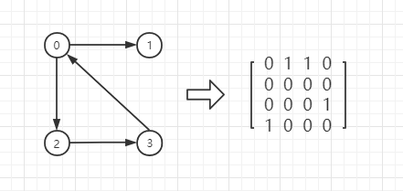

无向图的示例矩阵如下所示：

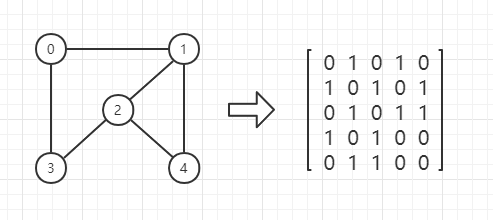

> 在这里你可以观测到无向图的邻接矩阵的对称性（也就是矩阵整体沿着[0][0]->[4][4]的斜线对称），0结点和1结点之间右边，所以[0][1]和[1][0]都是1，这也说明了，在结构上，无向图其实是有向图的一个特例（每条边同时拥有两个方向），在这个问题上衍生了一个矩阵压缩问题，在代码实现一节会详细提到

其实到这里有小伙伴要问了啊，矩阵数值的0和1是固定的吗？当然不是，你想取什么就取什么，只要能区分无边和有边就行了，同时在带权图中，这个0/1可以衍生为权重值，表示从结点m到结点n所需要的代价，下图是一个有向带权图的简单示例（有点丑别介意）：

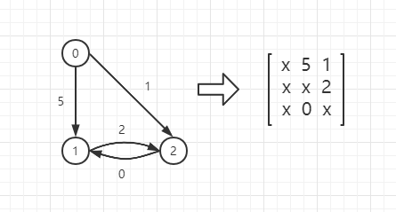

> 在之前的图中，0表示没边，但是这里0是权重值的一种，所以“无边”改成了字符"x"，这个取值其实是比较随意的，看个人习惯

在这里需要最后提一个点，那就是**邻接**这个概念，如果你仔细观察上面的各个图的邻接矩阵，会发现，矩阵中的第i行数据，都是从i结点**指出**的边，第j列数据，都是**指向**j结点的边，这些边在图形中都是兄弟关系，所以称**联结**，联结边在图的遍历和搜索中是一个非常重要的概念。此外我在这边罗列了一些邻接矩阵表示法的一些性质和要点：

- 无向图的邻接矩阵一定是一个对称矩阵（且唯一），所以在存储时可以采取“上三角阵压缩法”
- 对于无向图，邻接矩阵的第i行/列的非零元素即第i个结点的度
- 对于无向图，邻接矩阵的第i行/列的非零元素即第i个结点的出/入度
- 简单应用时，通常直接使用二维数据来实现矩阵
- 稠密图适合采用邻接矩阵法

###### 2. 邻接表

邻接矩阵在一开始就固定了图的大小，在存储稠密图时很给力，但是如果我们存储的是一个稀疏图，那么邻接矩阵就会浪费大量的存储空间，于是出现了另一种存储方案，也就是邻接表法，邻接表同时使用了顺序存储和链式存储，极大地减少了空间浪费

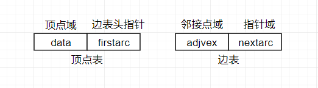

和邻接矩阵一样，邻接表也要完整表示图的**顶点集**和**边集**，在邻接表中，由一个数组来存储所有的顶点结点，这个数组称为顶点表（其中每个元素都代表了一个顶点），每个结点会带一个“小尾巴”，形式上一般是一个单链表，单链表中的元素为该顶点所持有的边，这条单链表称为边表（其中每个元素都代表了一条边），下图是一个无向图的邻接表示例：

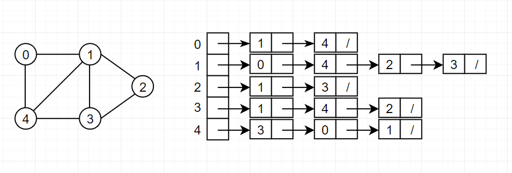

可以看到邻接表极大减少了空间浪费，再看一个有向图的例子：

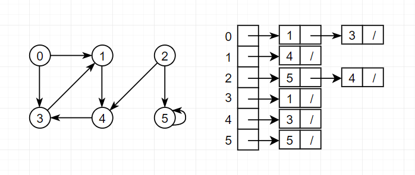

> 注意到这个5结点有一个自环（或者说自旋）
> 我们这边观察到每个结点的单链表似乎是有序的，但其实顺序在图结构里没有意义，这个“边集”的单链表你想怎么排序都行，实现时通常采用迭代器

和邻接矩阵一样，我在这里罗列了一些邻接表的性质和要点：

- 如果是无向图，每条边会在连接表中出现两次，所以存储空间为O(|V|+2*|E|)，而如果时有向图，每条有向边只出现一次，存储为O(|V|+|E|)，在实际编程中，我们会将无向图看作有向图的特殊形式，大多数时候在实现上不做区分
- 对于稀疏图，采用邻接表存储可以极大程度节约空间
- 对于“邻接”这个概念，在邻接表中，如果想访问一个顶点的所有边是非常容易的，只要遍历它所携带的那条链表（边表）就行了，链表上的每个元素的next的实意是“当前边在附着点上的兄弟边”。但是如果想确定两个顶点是否存在边，就需要扫描整个表了，而在邻接矩阵中，只要访问\[i]\[j]是否=1即可（这就是邻接矩阵作为完全顺序存储的优势，虽然空间上不讨好，但是读写很快）
- 同样的，在有向图中，确定一个顶点的出度只要遍历其边表（也就是所持有的单链表）即可，但是如果要确定其入度，则要遍历全表
- 上文提过，图的邻接表表示并不唯一，因为每个顶点所携带的表示边集的单链表是无序的，其次序取决于建立邻接表时数据输入序列和所用的算法

> 对于实际应用来说，邻接矩阵和邻接表是最常见的两种图的存储方式，但是针对邻接表的一些结构问题，衍生出两种优化型的邻接表结构，通常不做要求，理解即可（因为形式上有点复杂，不是很好理解，实际的使用频率也不是特别高），下文会简单讲述一下**十字链表**和**邻接多重表**

###### 3. 十字链表

十字链表是邻接表针对**有向图**的一种优化链式存储结构，为的是解决邻接表的```出入度计算问题```。十字链表是一种模拟邻接矩阵的类邻接表结构，在**实现上可以看作是邻接表和逆邻接表的合体**，兼顾了邻接表对稀疏图的有效空间利用和邻接矩阵行列快速求解出入度的优势

在这里我给出了一个有向图的例子来解释一下十字链表的由来，图中分别是有向图的图例，邻接矩阵表示，邻接表表示和逆邻接表：

> 通常有向图的邻接表顶点A持有的表示弧集的单链表代表的是出弧（由A指向某个顶点B的弧），逆邻接表所表示的则是入弧（由某个顶点B指向A的弧），前者容易计算顶点出度，后者容易计算顶点入度

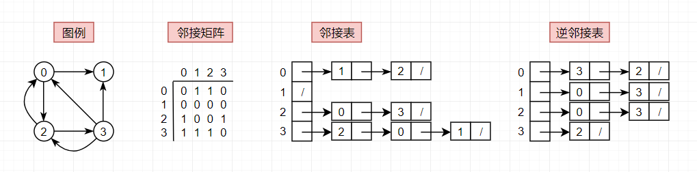

前文在邻接表的一节中提过，对于有向图的邻接表来说，计算某个顶点的出度是很容易的，只要遍历其持有的单链表（弧集）即可，但是计算其入度则要遍历整个表，这就非常蛋疼了（对于逆邻接表则是反的，很容易计算顶点的入度，但是计算出度要遍历全表），而在另一边，使用邻接矩阵的有向图，顶点i的出度为```[i][*]```的有效和，入读为```[*][i]```的有效和，以上图的```顶点1```为例：

- 出度=行和=\[1]\[0]+\[1]\[1]+\[1]\[2]+\[1]\[3]=0
- 入度=列和=\[0]\[1]+\[1]\[1]+\[2]\[1]+\[3]\[1]=2

> 为了模拟邻接矩阵这种行和列的关系，我们将邻接表和逆邻接表结合，就可以得到```十字链表```了

对于十字链表来说，依旧是采用顶点数据和弧集链表的方式，顶点集和弧集的结点结构如下：

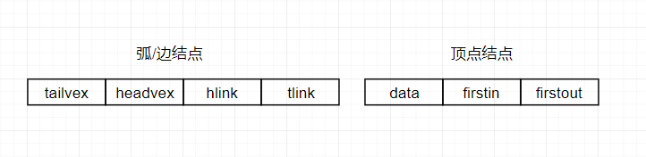

十字链表的弧结点是有向图的邻接表和逆邻接表中弧结点的组合，代表一条弧（也就是有向边），其各部分释义如下：

- tailvex/headvex：这条弧为```tailvex->headvex```（也就是由tailvex指向headvex，vex是顶点的意思，有向图中每条弧的方向都是弧尾tailvex指向弧头headvex）
- hlink：指向弧头相同的下一条弧（等价于逆邻接表中的nextarc）
- tlink：指向弧尾相同的下一条弧（等价于邻接表中的nextarc）

十字链表的顶点结点是有向图的邻接表和逆邻接表中顶点结点的组合，其同时持有两个单链表起点，其各部分释义如下：

- data：表示其实体数据，一般是结点id
- firstin/firstout：以该顶点为弧头/弧尾的第一条弧

下图是上文图例的十字链表表示：

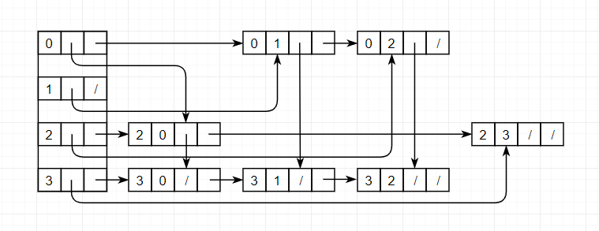

> 值得注意的是，顶点集依旧是顺序存储的

注意观察下图的染色部分，通过剥离顶点结点的in链和out链，我们可以分别把十字链表退化成邻接表和逆邻接表：

- 剥离out方向：十字链表退化成邻接表

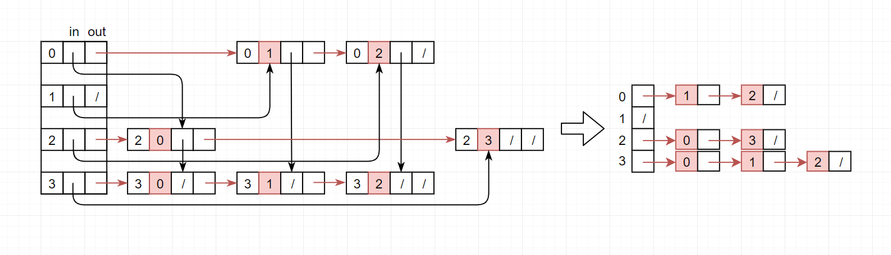

- 剥离in方向：十字链表退化成逆邻接表

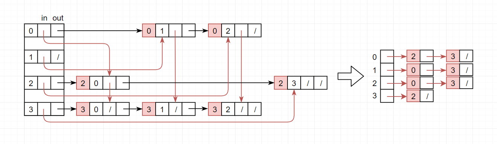

这里罗列十字链表的几个性质和要点：

- 十字链表是一种针对**有向图**的链式存储结构
- 在十字链表中，对于一个顶点vi，既可以容易找到vi为尾的弧，又容易找到vi为头的弧，因而容易求得顶点的出度和入度，而无需像在邻接表中那样遍历全表
- 图的十字链表表示不是唯一的，但是一个十字链表可以确定一个图
- 一个有向图的十字链表可以退化成邻接表和逆邻接表
- 在Linux内核中有广泛应用

###### 4. 邻接多重表

十字链表是针对**有向图**的一种优化结构，那么邻接多重表就是针对**无向图**的一种优化链式存储结构，其核心思想是```多链表结点重叠结构```

我们前文提到过，无向图其实可以看作有向图的一种特殊情况，无向图的每条边，其实都可以看作两条平行的弧，因此在无向图的邻接表中，每条边会出现两次，这就当我们需要新增或者删除某条边时，需要遍历全表，这就显得非常不环保，所以出现了**邻接多重表**，将无向图的邻接表中中同一条边的两个副本重叠，从而减少遍历负担

我们来看一个无向图的图例及其邻接表表示：

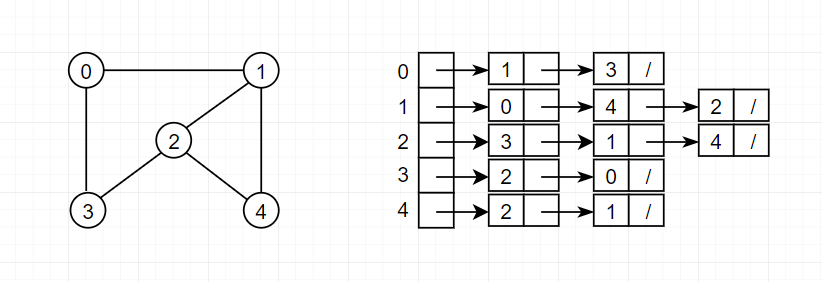

可以清楚地看到，无向图的边数为6，而其邻接表的边结点数为12，每条边都出现了两次，它们表示的其实是同一条边，这就其实造成了一种冗余，也是我们删除困难的诱因，所以我们重新设计一下边结点的结构，参考双向链表的设计，使其能同时链接在两个链表（每天链表都表示某个顶点vi的所有边，这其实就是将我们的边的两端设置成其所连接的两个顶点）中，完整结构如下：

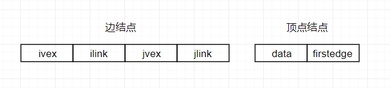

顶点结点和邻接表中没有区别，主要是边结点，它其实就是把邻接表中的一条边的两个结点缝合在一个结点里，各个域的释义如下：

- ivex/jvex：为该边依附的两个顶点id
- ilink：指向下一条依附于顶点ivex的边（也就是邻接的概念，指向兄弟边，目的是方便遍历）
- jlink：指向下一条依附于顶点jvex的边（也就是邻接的概念，指向兄弟边，目的是方便遍历）

通过这个结构，使得**每个边结点同时链接在两个链表中**，下面是上文图例的临接多重表的表示：

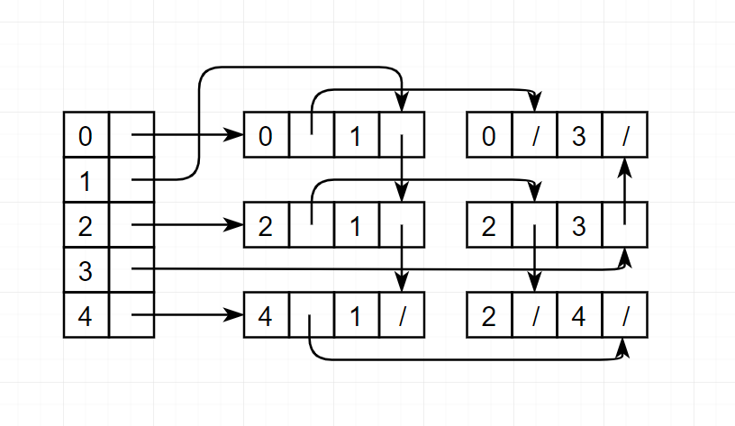

可以观察到，边结点的数目由之前的12个降到了6个，在这里每条边只出现了一次，也就是说每条边只有一个边结点，于是在删除和新增边的时候，就没有了之前奇奇怪怪的扫描问题

> 同样地，邻接多重表可以像十字链表拆分邻接表那样，拆分成其最初的邻接表，这里留给读者大人们自己实现一下，就当是熟悉邻接多重表的小练习了（其实是作者偷懒XD）

这里罗列一下邻接多重表的几个性质和要点：

- 邻接多重表就是针对**无向图**的一种优化链式存储结构
- 邻接多重表是为了解决无向边的邻接表在删除边时需要扫描全表的问题
- 邻接多重表中每条边只有一个结点

> 至此

#### 子图的表示问题

子图的问题其实在图的存储中不是什么难题，甚至完全不需要关心，就比如下图是一个非连通图（树可以看作一种特殊的图，森林其实就是一幅图），依旧采用邻接表法，和一般表示没有区别：

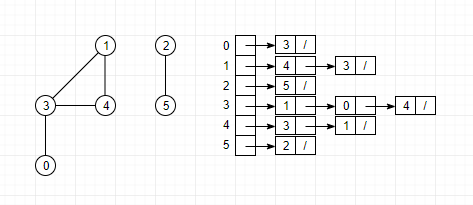

> 在处理全图遍历的时候可能会有一点点不同，但是很容易调整，这不是本篇的重点

#### 图的封装和代码实现

由于图处理的相关算法种类众多，而且图的存储结构对算法的实现和效率有很大的影响，所以图类数据结构和算法设计的首要目标就是把**把图的表示和实现分离开来**，落实到代码上就是分层次设计```图的表示```，```图的存储```和```处理算法实现```。首先要说明一下，图论真的是相当灵活和多变的结构，所以JDK的集合框架没有提供通用图接口（因为实在是没有“万能”的图结构代码模板），而在实际的编程中，也不会煞费苦心设计一个类似```java.util.List```一样的接口类，经常就直接写了个二维数组就开始实现算法了，所以没必要煞费苦心去搞什么抽象图结构代码。想把代码写复杂很容易，但是写简单却很难，图论算法的一个Magic的地方就是，一些很少的性质，就可以实现很复杂的图的构造和优化搜索，本文在实现上，体现图论的结构核心为主，涉及的一部分oop只是我组织代码用的，重点应该是还是数据结构本身

> 本节的代码请参见[graph-algorithm-kit](https://github.com/bladeXue/graph-algorithm-kit)，这也是本文所在专栏的基础代码，演示为主，为了表达简洁，砍掉了很多内容，实际应用请根据需求调整

图结构设计的重点就是**把图的表示和实现分离开来**，在正式编写代码之前，我们可以先确定一下一个有效的图结构，必须完成哪些功能：

- 有效表示顶点集和边集
- 图是否存在边\<v,w>
- 列出顶点v的邻接边
- 输出某顶点的第一个邻接点
- 输出某顶点的下一个邻接点
- 插入/删除一个顶点
- 插入删除一条边
- 获得/重置某条边的权重值

尽管这么说，其实很多功能对于一个最小功能的图结构是不需要的，比如删除一个顶点，其实很多时候并不是一个必要功能，于是我们定义的最小图结构代码如下所示：

```java
// 一个抽象的无向图
public interface Graph {

    // 返回G=(V,E)的顶点数和边数
    int V();
    int E();

    // 新增一条边
    void addEdge(int v, int w);
    // 获取某个顶点的所有邻接点
    Iterable<Integer> adj(int v);
}

// 一个抽象的有向图图
public interface Digraph extends Graph {

    // 输出一张逆向图
    Digraph reverse();
}
```

没错，如你所见，我们定义的最小图结构其实就两个计数方法和两个核心方法，其中```adj()```方式是最核心的方法，这涉及了邻接结构的核心和图类算法的**短视性**

> 短视性，又称**局部可见性**，是链式结构的常见属性，指程序在扫描链式结构时，通常同时只能查看当前结点和其直接相连的结点，类似“盲人摸象”，只能见局部，不可见整体，但是正是由于这种特性，可以和递归算法很好搭配，也造成了图论算法的简洁性，尤其是操作成千上万顶点的图时尤其明显

虽然我一直在讲无向图是一种特殊的有向图balabala，但是在实现的时候，我还是把它们分开了，尽管无向图的代码随便改两行就可以拿到有向图那边用了，但是为了条理更清晰，我还是分开写了

在上文放出的repo里，一共有两个核心接口```Graph```和```Digraph```，实现了8个存储类```ListDigraph```，```ListGraph```，```MatrixDigraph```，```MatrixGraph```，```MultiListGraph```，```OrthogonalDigraph```，```SetDigraph```，```SetGraph```和一个工具类```Graphs```，备注如下

|          名称           |        继承关系      | 实现结构 |           描述            |
| ----------------------- | ------------------ | ------- | ------------------------- |
| interface Graph         |  -                 | 接口     | 无向图接口                 |
| interface Digraph       | extends Graph      | 接口     | 有向图接口，继承自无向图     |
| abstract class Graphs   |  -                 | 抽象类   | 工具类，封装各种对图操作函数 |
| class ListDigraph       | implements Digraph | 类      | 有向图的邻接表存储结构      |
| class ListGraph         | implements Graph   | 类      | 无向图的邻接表存储结构      |
| class MatrixDigraph     | implements Digraph | 类      | 有向图的邻接矩阵存储结构     |
| class MatrixGraph       | implements Graph   | 类      | 无向图的邻接矩阵存储结构     |
| class MultiListGraph    | implements Graph   | 类      | 无向图的邻接多重表存储结构   |
| class OrthogonalDigraph | implements Digraph | 类      | 有向图的十字链表存储结构     |
| class SetDigraph        | implements Digraph | 类      | 有向图的邻接集存储结构      |
| class SetGraph          | implements Graph   | 类      | 无向图的邻接集存储结构      |

> 这些方便演示，都是简单图（无自环无平行边）且不带权
> 由于条目比较多，这里只演示```ListGraph```，其余的请自行阅读代码

ListGraph是无向图的邻接表存储结构（个人比较常用的，因为实现比较清晰，比邻接矩阵更环保一点），其完整的类签名如下：

```java
public class ListGraph implements Graph {}
```

其所实现的Graph接口，完整如下：

```java
// 一个抽象的无向图G=(V,E)
public interface Graph {

    int V();    // 顶点数
    int E();    // 边数

    void addEdge(int v, int w);     // 新增一条边
    Iterable<Integer> adj(int v);   // 获取某个顶点的所有邻接点

    // 静态内部类，封装了几个工具函数
    static class GraphUtils {

        // 判定顶点索引是否越界（本例中，顶点id就是）
        public static void validateVertex(int v, int V) {
            if (v < 0 || v >= V) {
                throw new IllegalArgumentException("vertex " + v + " is not between 0 and " + (V - 1));
            }
        }

        // 将图以邻接表字符串的形式打印
        public static String printAdjacencyList(Graph g) {
            StringBuilder sb = new StringBuilder("the graph of " + g.getClass().getSimpleName() + " : ");
            sb.append(g.V()).append(" vertices, ").append(g.E()).append(" edges \n");
            for (int i = 0; i < g.V(); i++) {
                sb.append("[").append(i).append("]");
                for (Integer integer : g.adj(i)) {
                    sb.append("->").append(integer);
                }
                sb.append("\n");
            }
            return sb.toString();
        }

        // 将图以邻接矩阵字符串的形式打印
        public static String printAdjacencyMatrix(Graph g) {
            StringBuilder sb = new StringBuilder("the graph of " + g.getClass().getSimpleName() + " : ");
            sb.append(g.V()).append(" vertices, ").append(g.E()).append(" edges \n");

            int V = g.V();
            int[][] matrix = new int[V][V];
            for (int v = 0; v < V; v++) {
                for (Integer w : g.adj(v)) {
                    matrix[v][w] = 1;
                }
            }

            sb.append("   ");
            for (int i = 0; i < V; i++) {
                sb.append(i).append(" ");
            }
            sb.append("\n");

            // row i
            for (int i = 0; i < V; i++) {
                sb.append(i).append(": ");
                for (int j = 0; j < V; j++) {
                    sb.append(matrix[i][j]).append(" ");
                }
                sb.append("\n");
            }

            return sb.toString();
        }

        // 判定插入边v->w后是否依旧是简单图，true->is simple
        public static boolean checkSimpleGraph(Graph graph, int v, int w) {
            for (Integer i : graph.adj(v)) {
                // 自环或平行边
                if (v == w || i.equals(w))
                    return false;
            }
            //throw new RuntimeException("edge has exited: " + v + " -> " + w);
            //可以选择抛异常或者缄默，这里选择缄默
            return true;
        }

        // 这是一个选择缄默的简单图判定，大致和上面的一致
        public static boolean checkSimpleGraph(Graph graph, int v, int w, boolean throwE) {
            for (Integer i : graph.adj(v)) {
                // 自环或平行边
                if (v == w || i.equals(w))
                    return false;
            }
            if (throwE) {
                throw new RuntimeException("edge has exited: " + v + " -> " + w);
            }
            return true;
        }

        // 独立判定平行边
        public static boolean hasParallel(Graph graph, int v, int w) {
            for (Integer i : graph.adj(v)) {
                if (i.equals(w))
                    return true;
            }
            return false;
        }

        // 独立判定自环
        public static boolean isLoop(Graph graph, int v, int w) {
            return v == w;
        }
    }
}
```

接下来是ListGraph的完整源码：

```java
import java.util.*;

public class ListGraph implements Graph {

    private final int V;  
    private int E;  
    private final List<List<Integer>> adj;  // 这里没有采用我自己写的链表而是JDK的集合类，减轻阅读负担   

    public ListGraph(int v) {
        if (v < 0) {
            throw new IllegalArgumentException("Number of vertices must be nonnegative");
        } else {
            // 初始化计数器
            this.V = v;
            this.E = 0;

            // 初始化邻接表，顺序存储+链式存储
            this.adj = new ArrayList<>(v);
            for (int i = 0; i < v; i++) {
                this.adj.add(i, new LinkedList<>()); // 其实你用Vector也是没有任何问题的
            }
        }
    }

    @Override
    public int V() {
        return this.V;
    }

    @Override
    public int E() {
        return this.E;
    }

    // 新增一条边
    @Override
    public void addEdge(int v, int w) {
        // 越界检查
        GraphUtils.validateVertex(v, this.V);
        GraphUtils.validateVertex(w, this.V);

        // 简单图拒绝自环和平行边
        if (GraphUtils.checkSimpleGraph(this, v, w)) {
            this.adj.get(v).add(w);
            this.adj.get(w).add(v);
            this.E++;
        }
    }

    @Override
    public Iterable<Integer> adj(int v) {
        return this.adj.get(v);
    }

    @Override
    public String toString() {
        return GraphUtils.printAdjacencyList(this);
    }
}
```

这里简单解释一下这个类，整体上是“数组+链表”的标准邻接表结构，一开始是用我自己写的背包结构（其实就是单链表）实现的，但是我知道读博客的都不太喜欢看本篇幅之外的过多内容，所以干脆用了集合框架，但其实实际应用时我也是支持用集合框架的，因为你自己写的链表，可能会有bug，性能还没人家集合框架好。。。。

整个代码中最核心的部分就是```adj()```方法了，这个方法返回一个可迭代对象，可以说是所有图论结构的核心了，我们这里用的集合框架，所以一行就搞定了，但其实如果自己写可以更加细腻（参见十字链表的代码）

###### 测试用例1：

```java
public class TestGraph {

    public static void main(String[] args) {

        Graph g = new ListGraph(5);

        g.addEdge(0, 1);
        g.addEdge(1, 2);
        g.addEdge(0, 4);
        g.addEdge(1, 4);
        g.addEdge(1, 3);
        g.addEdge(4, 3);
        g.addEdge(3, 2);
        g.addEdge(3, 2);    // 陷阱1，平行边
        g.addEdge(3, 3);    // 陷阱2，自环

        System.out.println(g.toString());
        // 输出
        // the graph of ListGraph : 5 vertices, 7 edges 
        // [0]->1->4
        // [1]->0->2->4->3
        // [2]->1->3
        // [3]->1->4->2
        // [4]->0->1->3
    }
}
```

其实就是上文的演例之一：


###### 测试用例2：

这里贴上一部分Graphs工具类代码，可以清晰看到，简单的邻接结构是多么给力：

```java
// 操作图的工具类，类似集合框架的Arrays类
public abstract class Graphs {

    // 计算某个顶点的度
    public static int degree(Graph graph, int v) {

        int degree = 0;
        for (int i : graph.adj(v)) {
            degree++;
        }
        return degree;
    }

    // 计算最大的度
    public static int maxDegree(Graph graph) {

        int max = 0;
        for (int i = 0; i < graph.V(); i++) {
            int de = degree(graph, i);
            if (de > max) {
                max = de;
            }
        }
        return max;
    }
}
```

到此就是无向图的邻接表演示，更多的代码请阅读GitHub（写得比较匆忙，看到问题记得issue）

#### 一点碎碎念

###### 关于存储结构的抉择

图是数据结构中最复杂最灵活也是最重要的一类结构，使用场景成千上万，存储结构极其多变（如果你看了十字链表的实现，想必你深有体会），不同情况下选择不同的数据结构会对程序效率造成极大影响

在为图选择存储结构时，通常有以下考虑：

- 稀疏或者稠密
- 读频繁还是写频繁
- 业务模型适合图吗
- 这个结构是否会被很多程序引用

举个例子，如果程序仅仅是实现一个简单的状态转移，那么邻接矩阵是一个很不错的选择，你甚至不需要封装图结构，直接一个二维数组+几个操作函数就可以用了，但是V个顶点的图采用邻接矩阵会有O(V**2)的空间损耗，如果是一个地图应用， 那么会有几百万个顶点，这对于空间消耗来说是难以接受的，所以多数情况下使用的是邻接表，在更要求性能的情况下也会升级成十字链表和邻接多重表，但是这两个都是比较复杂的高级数据结构了，写起来比较麻烦，所以比较中庸的做法是邻接表或者邻接集

当然了，所以的片面之词，都不及在你实际的业务中，自己尝试，采用最适合业务的结构

###### 如何使用图结构

其实在实际业务中，很难看见正儿八经像集合框架一样封装的图结构，基本都是想到就用，直接二维数据+操作函数就上，或者数组+线表直接实现了邻接表就上的例子多得是，主要还是图论太过灵活了，很少可以看到一个图结构在多个场景中重复使用的，基本上是A场景来个AOE网，B厂家来个自动机，很少会出现抽象封装的Graph类（本文是为了方便组织各个存储实现代码，业务上是不会有的）

但是设计图结构的宗旨是不变的：

- 图的表示和存储分离
- 设计尽可能少和简单的API

通常来说，你会遇到图论的地方只有两个：

1. 笔试题
2. 业务核心

在第一种情况中，通常是类似Leetcode或者ACM一类的的在线编程平台，如下所示：

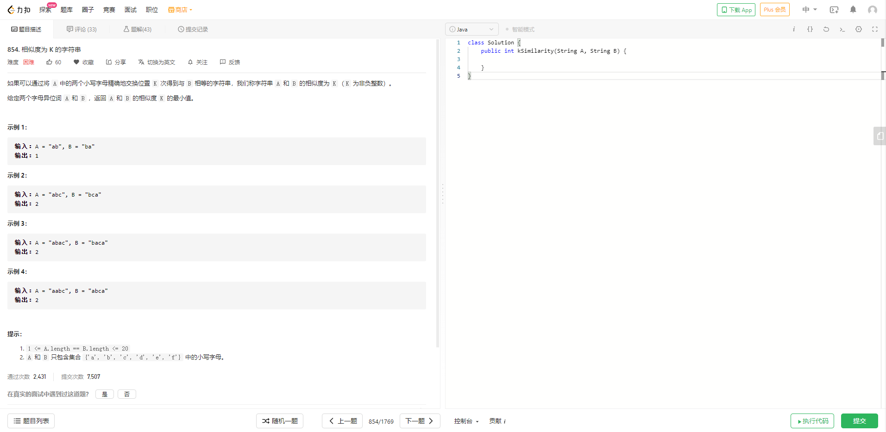

通常没有什么机会让你把一套代码拆分成多个文件，而且编程时间有限，我们通常会把图论的代码收缩成一套特别简单的demo，然后背一背，遇到这种题目，也别考虑什么封装性了，直接数组+链表写一个邻接表就行了，别整太多花里胡哨的，而第二种情况，当你遇到很复杂的业务逻辑，需要设计一个图结构时，也是简单至上，因为图的API已经很复杂了，再往你的业务里一杵，复杂度能累死你，而且图结构的适应性比较差，一般就是一个问题场景设计一个专用图，换个场景再设计一个，很少会有“万金油”的一类抽象图

#### 总结

图的存储是图论的基础，多看源码，多拍砖，看到有错记得issue

#### 参考

[wiki-图论](https://zh.wikipedia.org/wiki/图论)
[Algorithms, 4th Edition](https://algs4.cs.princeton.edu/home/)


