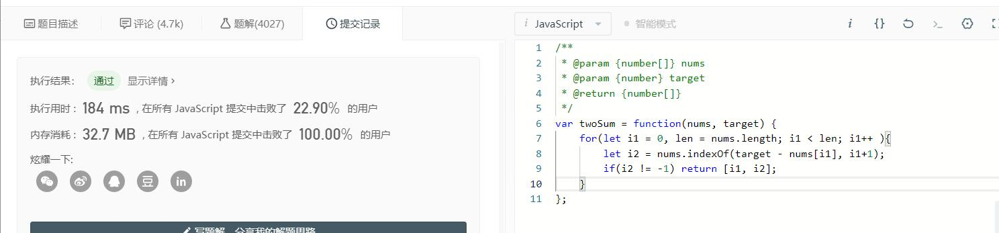

# 经典算法题解-两数之和

> 题目来源：[LeetCode-两数之和](https://leetcode-cn.com/problems/two-sum/)
> 题目难度：简单

<!-- more -->

#### 问题描述

给定一个整数数组nums和一个目标值target，请你在该数组中找出和为目标值的那**两个**整数，并返回他们的数组下标。你可以假设每种输入只会对应一个答案。但是，数组中同一个元素不能使用两遍

示例：
1. 给定 nums = [2, 7, 11, 15], target = 9
2. 因为 nums[0] + nums[1] = 2 + 7 = 9
3. 所以返回 [0, 1]

#### 问题分析

这个问题在理解上没有什么难点，主要就是给定一个数组和一个目标数target，其中每个元素至多使用一次，要求找到两个元素A和B，使得它们的和正好等于给定的target，返回这两个适格数字的下标。题目已经假定每个数组和target的组合只有有一个正确答案

题目很好理解，解法也很容易，直接双重for循环就可以解：

###### 1. 双重for循环

直接看代码，这里给出Java的实现：

```java
class Solution {
    public int[] twoSum(int[] nums, int target) {
        // 第一轮遍历
        for (int i = 0; i < nums.length; i++) {
            // 第二轮遍历不能重复计算了
            for (int j = i + 1; j < nums.length; j++) {
                if (nums[i] + nums[j] == target) {
                    // 注意leetcode原题中要求返回的是索引位置
                    return new int[]{i, j};
                }
            }
        }
        return null;
    }
}
```
> 时间复杂度O(N^2)，空间复杂度O(1)

上面这个双重for循环算法，先使用变量i遍历目标数组，然后对于每个元素，再追加遍历其位置至数组尾部的所有元素（因为之前的元素已经在i之前的遍历中比较过了），最终计算出相关位置。因为是双重for循环，所以很容易就可以计算出时间复杂度O(N^2)，空间复杂度O(1)

###### 2. 字典遍历法

双重for循环虽然很容易想到，但是O(N^2)的时间代价明显不太行，所以考虑对其进行一些优化，对于优化，我们常见的策略有3种：

- 减少冗余计算
- 采用特殊数据结构
- 时间换空间

回到我们的题目上，假设有这么一个数组\[6, 4, 1, 3, 7, 8, 9\]，且目标数target=17，那我们可以发现，对于9之前的\[6, 4, 1, 3, 7, 8\]，其实每个数字在遍历时，都和9进行了一次比较，知道8+9=17才结束，这期间9其实被使用了6次，这明显是冗余了

所以我们希望有这么一个策略，在我们顺序遍历取得一个数num1的时候，就知道和它配对的数target-num1是否在我们的nums里面，并且不单单只存在一个。比如说target为4，nums为\[2,3\]，假设我们此时取得的num1为2，那么和它配对的2确实在nums中，但是数字2在nums中只出现了一次，我们无法取得两次，所以也是不行的。因此我们最终获得了以下步骤：

1. 建立字典lookup存放第一个数字，并存放该数字的index
2. 判断lookup中是否存在(target-当前数字cur)， 则当前值cur和某个lookup中的key值相加之和为target
3. 如果存在，则返回：(target-当前数字cur)的index与当前值cur的index
4. 如果不存在则将当前数字cur为key，当前数字的index为值存入lookup，继续计算下一个数

这里给出Java的示例代码：
```java
class Solution {
    public int[] twoSum(int[] nums, int target) {
        HashMap<Integer, Integer> map = new HashMap<>();
        for (int i = 0; i < nums.length; i++) {
            // 将原本为两个目标值切换为一个目标值，只需要每次从 map 中寻找目标值即可
            int num = target - nums[i];
            if (map.containsKey(num)) {
                return new int[]{map.get(num), i};
            }
            // 每次遍历过的值都存储到 map 中，这样之后就能从 map 中寻找需要的目标值
            map.put(nums[i], i);
        }
        return null;
    }
}
```
> 时间复杂度O(N)，空间复杂度O(N)

这个算法改造，完整使用了我们上述3个改进策略，使用散列存储已经匹配过的结果，而且由于数据结构特性，散列表的读取都是O(1)（采用特殊数据结构），虽然读取快了，但是散列表本身会占据内存（时间换空间），采用散列之后，原本的双重for循环变成了一重（减少冗余计算），最终的时空复杂度均为O(N)，从代价上看明显小于原来的时间O(N^2)

#### 一点碎碎念



上面这个图是我在一个前端群里看见的，图的作者原话是说自己的题解消耗有点大。稍微看一下代码，这个小老弟虽然只写了一层循环，乍一看代码还挺干净，但其实indexOf()方法本身也是一个遍历操作，所以在执行方面，这个其实还是一个双重for循环的做法，虽然本题非常简单，但是这个小老弟的写法还是提醒我们，在构建算法的时候，一定要小心局部的一些处理，很有可能随手一些，性能就打了折扣，尤其是构建一些复杂算法时，局部的细节处理一定要到位

#### 总结

本题属于简单题，实现上很简单，本篇也给出了对应的Java代码实例，同时一个老兄的代码给我们提了个醒，性能的折扣很有可能出现在一些微小的地方。唯一需要注意的是，在考虑给算法优化的时候，最基本的3点策略还是：

- 减少冗余计算
- 采用特殊数据结构
- 时间换空间

如果你发现了bug，或者有自己的想法，请给博主发邮件，或者在评论区戳我，感谢阅读(′▽`〃)
