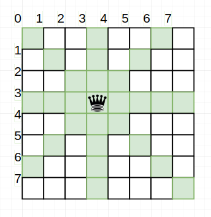
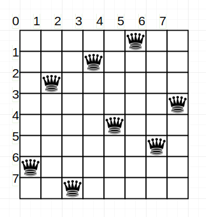
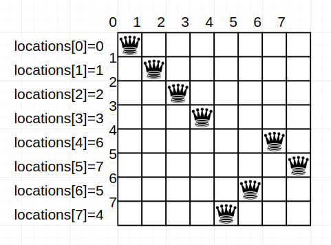
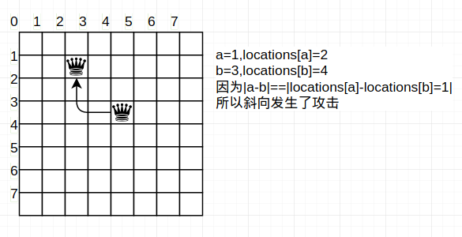
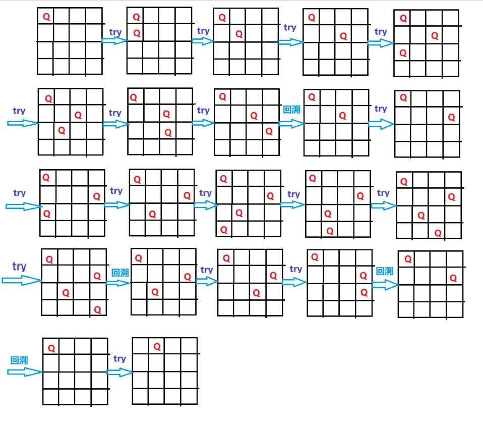

# 经典递归回溯算法-八皇后问题及其推广的n皇后问题

> 一个比计算机历史都老的问题
> 递归回溯算法的经典应用场景
> 关于无模型的可计算问题
<!-- more -->

#### 问题描述

首先给没下过国际象棋的同学们科普一点背景知识，在国际象棋中，棋盘是8*8的，一共64个格子，皇后是其中最强的棋子，走法类似中国象棋中的车（可以前往横向和纵向的任何一个未被阻挡的位置），但是国际象棋中的皇后，除了横向和纵向外，还可以移动斜方向，如下图（绿色为皇后可以前往的位置，有时在术语中称“占领区”或者“看守线”）：



回到我们的八皇后问题的定义来：

1. 在一个8*8的棋盘上放置8个皇后
2. 找到一种放法，可以使这8个皇后无法互相攻击，和平共处

这个问题最早是由一个19世纪的棋手提出来的，后来由原本的“八皇后问题”推广到了“n皇后问题”，也就是变化数字8，在一个n\*n的棋盘上放置n个互相不攻击的皇后。一个基本的八皇后的解法，其中8个皇后，无论横纵还是斜向，都**无法互相攻击**：



#### 关于可计算性和这个问题的一点点数学背景

类似七桥问题，历史上很多数学家都研究过这个八皇后问题，包括高斯（数学王子，数论大师）和康托（朴素集合论创始人，历史上真正的数学天才之一）等一众大佬都研究过这个问题，但是一直没有找到特别好的方式去找到八皇后问题中的数学模型，目前已知的方法只能通过极其复杂的行列式去进行推导，研究结果也大多是某些特定的放置图形，或者当n为某个数时有多少种放置法

> 关于编程问题的数学模型，如果你去计算一个{1...n}的等差数列的和，可以用while循环去一个个加起来，但是这个问题本身是有一个公式的，也就是(1+n)\*n*0.5，所以等差数列的求和问题是一个有内在数学模型的问题，但是八皇后问题没有内在数学模型，只能通过计算机的特殊性质去求解，比如大规模迭代或者递归，这都是人不擅长，但是机器尤其擅长的问题，对于一个问题是否可以通过计算机的递归函数模型来计算的问题称为可计算问题，是离散数学的重要课题之一

n皇后问题中，关于n的取值和相关解的数目的表格：

|  n  | 	1	 |  2   | 	3 |  	4	   |   5	    |  6	   |  7	  |  8	   |    9	    |    10    | 	11	  |     12	      |      13       |      	14       | 	.. |
| --- | ------ | ---- | ----- | ------ | ------ | ---- | --- | ----- | ------- | -------- | -------- | ------------- | ------------ | -------------- | ---- |
| U  | 	1   | 	0   | 	0	  | 1       | 	2	 | 1	    | 6	   | 12   | 	46    | 	92	 | 341     | 	1787	  | 9233      | 	45752  | 	.. |
| D  | 	1   | 	0	 | 0     | 	2	 | 10    | 	4	 | 40 | 	92 | 	352 | 	724	   | 2680 | 	14200 | 	73712 | 	365596 | 	..   |
> n代表在n*n的棋盘上放置n个皇后，U为独立解，D为互不相同解（某些解通过旋转棋盘会重叠，去掉可通过旋转和对称来重叠的解成为独立解）。现在还没有已知公式可以对n计算n皇后问题的解的个数
> 可以看到我们的八皇后问题，本身拥有92个解，其中有12个独立解
> 只有n>=4时n皇后问题才成立

#### 问题分析

想到这个问题的第一步其实很简单，既然是棋盘，我们直接枚举所有的情况，然后为每一种情况计算冲突，如果发现有冲突，则放弃本次情况，计算下一个情况，这么做看似简单，其实实施起来还是比较困难的，在一个64格的棋盘长摆放8个棋子，其实就是一个C(64,8)的组合，结果是4426165368，也就是你的程序要至少计算44亿次才能算出最终答案，这简直就是噩梦。但是回想一下小学数学，就会发现有一个巨大的优化方案，那就是抽屉原理

> 抽屉原理：在n个抽屉中随机放n+1个球，那么至少会有一个抽屉里会出现>=1个球。抽屉原理说明了在有限资源的抢占中会出现平均化和“排挤”现象

依旧观察我们之前给出的那个八皇后问题的解，会发现每个皇后都独占一个列和一个行，在不考虑斜向的情况下，会出现下面的情况，每个皇后独占一个行和一个列，对于第0行的皇后占领后，其实剩下7个棋子是在抢占一个7*7的子棋盘：


这就很明显了啊，使用一个{1,2,3,4,5,6,7,8}的排列组合，就可以轻松解决棋子之间的行列冲突，一个P(8,8)的全排列结果是40320，可比之前的44亿小多了，我们可以枚举一个全排列，在此基础上，检查其中的斜向是否存在冲突（互相攻击），如果冲突则转向下一个情况，由此出现了我们的第一个解法，全排列枚举法：

###### 1. 全排列枚举法

我们这里设置一个一维数组locations来表示棋盘，其中的每一个位置i都代表第i行，locations\[i]=j表示该行的皇后在第j列，比如有locations={0,1,2,3,6,7,5,4}，则有下图的棋盘：



nextPermutation()是一个全排列函数，将我们的locations数组排列成下一个全排列序列，我这里使用的是字典序算法构造的全排列，在本题中无需深究（可以看我另一篇讲[字典序全排列](https://bladexue.github.io/2020/07/15/algorithm/algorithm-exercise-next-permutation/)的博客），无论是递归法构造全排列还是字典法构造全排列，都是一样的，在本体中只要知道，每成功调用一次nextPermutation()函数，函数会从{1,2,3,4,5,6,7,8}->{1,2,3,4,5,6,8,7}或者{0,1,2,3,6,7,5,4}->{0,1,2,3,7,4,5,6}，也就是转换成它的下一个全排列序列，{0,1,2,3,6,7,5,4}->{0,1,2,3,7,4,5,6}的示例图如下：


hasConflict(current_row)则是冲突判断函数，由于本题用来全排列，横纵方向是绝对不会冲突的（每行只有一个皇后，且每个皇后都在0-7号不同的列上），只需计算行数差是否等于列数差即可，也就是\|a-b|==\|locations\[a]-locations\[b]|?，若相等，则说明在同一条斜线上，会发生互相攻击，下面就是一种会发生攻击的例子：



将P(8,8)=40320次枚举全部完成，就可以算出其中有多少次成立了，且这个解法可以从八皇后推广到n皇后，完整代码如下：

```java
import java.util.Arrays;

public class MainWithPermutation {

    private static int count;
    private static int n;
    private static int[] locations;

    static {
        // 初始化计数器，记录有多少种解法
        count = 0;
        // 初始化棋盘规模，这里八皇后，所以是8
        n = 8;
        // 初始化棋盘        
        locations = new int[n];
        for (int i = 0; i < n; i++) {
            locations[i] = i;   // locations={0,1,2,3,4,5,6,7}
        }
    }

    // 将目前待定位置（某个行数字）和其它确定（之前的，不包括之后的）位置比较，看是否合法
    // 无冲突即为false
    private static boolean hasConflict(int current_row) {
        for (int previous_row = 0; previous_row < current_row; previous_row++) {
            // 是否压线（存在互相攻击），压线则true
            if ((Math.abs(current_row - previous_row) == Math.abs(locations[current_row] - locations[previous_row]))/* || (locations[current_row] == locations[previous_row]) */) {
                return true;
            }
        }
        return false;
    }

    // 全排列函数的交换子函数，交换数列的某两位
    // {1,2,3,4}.swap(0,3) -> {4,2,3,1}
    private static void swap(int a, int b) {
        if (a < locations.length && b < locations.length) {
            int tmp = locations[a];
            locations[a] = locations[b];
            locations[b] = tmp;
        }
    }
    // 全排列函数的反转子函数，会将某一长度的尾部反转
    // {1,2,3,4}.reserve(1,3) -> {1,4,3,2}
    private static void reserve(int from, int to) {
        int offset = 0;
        while (offset < (to - from + 1) / 2) {
            swap(from + offset, to - offset);
            offset++;
        }
    }
    // 全排列函数的主体，会将数列locations排列成下一个排列序
    // boolean -> 是否找到了新的排列，若无下一个全排列了则false
    private static boolean nextPermutation() {
        // 1. 找到第一个升序
        int len = locations.length;
        int i = len - 2;
        while (i >= 0 && locations[i] >= locations[i + 1]) {
            i--;
            if (i < 0)
                // 小于零说明已经找到全部排列
                return false;
        }
        // 2. 在右侧的降序中找最接近i的那个大数
        int j = len - 1;
        while (i < j && locations[i] >= locations[j]) {
            j--;
        }
        // 3. 交换升序数和最小大数
        swap(i, j);
        // 4.反转尾部字符串
        reserve(i + 1, len - 1);
        return true;
    }

    // 打印函数，将棋盘输出在控制台上
    private static void printQueen() {
        System.out.println("the " + count + "th map for queens: ");
        for (int i = 0; i < locations.length; i++) {
            for (int j = 0; j < locations.length; j++) {
                if (j == locations[i]) {
                    System.out.print("Q, ");
                } else {
                    System.out.print("., ");
                }
            }
            System.out.println("");
        }
    }

    // 运行
    public static void main(String[] args) {
        do {
            int row;
            for (row = 0; row < locations.length; row++) {
                if (hasConflict(row))
                    break;
            }
            if (row >= n) {
                count++;
                printQueen();
            }
        } while (nextPermutation());
    }
}
```
> 字典序全排列的复杂度是O(n!)，整体的复杂度可以自己算一下复杂度（作者偷懒）

###### 2. 递归回溯法

这个是八皇后问题的最经典的解法，要知道八皇后问题在计算机领域为人所知就是因为巨佬Dijkstra在1972年的结构化编程的论文里，以八皇后问题为例，讲解了他所研究的深度优先搜索回溯算法（图论中计算最短路径的Dijkstra算法就是以他的名字命名的）

所谓的回溯法想必在大学里学数据结构时都接触过，简单来说就是维护一个记录型结构，并把问题的求解划分成n个子问题，第k层问题的解决依赖于第k+1层问题，且第k层会为第k+1层提供必要数据，当k+1层出错时，程序会回到第k层，k层调整部分参数后，调用新的第k+1层，在不断的调用和回溯过程中，最终达到解决问题所需要的条件（可用解）。说白了回溯法就是走迷宫：**从一条路往前走，能进则进，不能进则退回来，换一条路再试**

这里给出在4\*4棋盘中进行的4皇后问题，各位可以跟着箭头走一边，从而感受一下回溯过程是怎么发生的，尤其是其中的“**层层深入**”和**回溯现象**：



众所周知啊，递归的问题要么死活看不懂，一旦看懂就会特别简单，所以多说无益，还是直接看代码吧，在看实际代码前，做几点解释：

1. 在全排列方案中，使用的一维数组locations作为棋盘，这里则是用了一个二维数组，本质是没有区别的，只是在递归过程中，二维的棋盘方便理解而已，观众老爷们可以自己修改代码，把二维棋盘换成一维棋盘
2. 由于棋盘换了，所以重新编写了冲突检测函数，会分别检测当前棋子的北侧，系北侧和东北侧（也就是纵向正上方，斜向左上方和斜向右上方）
3. 阅读使用了递归算法的代码，一定要找到“我差遣我自己”的代码，也就是出现在函数体内的函数头，并重点关心其中的数据变化，这样可以很快理解一个递归算法

完整代码如下：

```java
import java.util.Arrays;

public class MainWithBacktrack {

    private static int count;
    private static int n;   // 在n*n的棋盘上部署n个皇后
    private static char[][] board;  // 双重数组，棋盘


    static {
        // 初始化计数器
        count = 0;
        // 初始化n，表示n个皇后在n*n的棋盘上，这里是八皇后，所以n=8
        n = 8;
        // 初始化棋盘，注意这里是二维棋盘，初值是'.'，表示没有棋子
        board = new char[n][n];
        for (int i = 0; i < board.length; i++) {
            for (int j = 0; j < board.length; j++) {
                board[i][j] = '.';
            }
        }
    }

    // 这是一个递归函数
    // backtrack(n)表示放置第n行的皇后，每一行的下棋都是一个k子问题
    private static void backtrack(int row) {
        
        // 放置第8行了，说明之前的0-7号都不冲突了，解成立了
        // 计数后输出
        // 这里其实就是递归出口
        if (row == n) {
            count++;
            printQueen();
            return;
        }

        for (int col = 0; col < board.length; col++) {
            // 如果当前合法，则将本格值设为'Q'，继续递归下一行的皇后
            if (isValid(row, col)) {
                board[row][col] = 'Q';
                backtrack(row + 1); // by rows
                board[row][col] = '.';  // 这里是回溯清零，本次递归完成后，已经置'Q'的位置要还原，不能影响下一次递归
            }
        }
    }
    
    // 工具函数，打印当前棋盘
    private static void printQueen() {
        System.out.println("the " + count + "th map for queens: ");
        for (int i = 0; i < board.length; i++) {
            for (int j = 0; j < board.length; j++) {
                System.out.print(board[i][j] + ", ");
            }
            System.out.println("");
        }
    }

    // 合法判定
    private static boolean isValid(int row, int col) {
        // north
        for (int offset = 1; offset <= row; offset++) {
            if (board[row - offset][col] == 'Q') {
                return false;
            }
        }
        // north-west
        for (int offset = 1; offset <= row && offset <= col; offset++) {
            if (board[row - offset][col - offset] == 'Q') {
                return false;
            }
        }
        // north-east
        for (int offset = 1; offset <= row && offset < board.length - col; offset++) {
            if (board[row - offset][col + offset] == 'Q') {
                return false;
            }
        }
        return true;
    }

    // 运行
    public static void main(String[] args) {
        backtrack(0);
    }
}
```
// 作者偷懒了，还是自己算一下复杂度吧

#### 运行测试

之前给出来n皇后的结果表，上面的代码我都自己跑过了，结果都是符合的，你们可以自己跑一下

#### 总结

八皇后问题是一个非常经典的递归回溯法的应用，应该自己写一下，好好掌握。在本质上，这是一个树形深度递归的问题，感兴趣的旁友可以自己继续深入，而不是仅仅看到表明问题的八皇后

如果发现文中错误，请在评论区留言或者直接邮件我，冒个泡也行

#### 参考

[wiki-八皇后问题](https://zh.wikipedia.org/wiki/八皇后问题)
[什么是八皇后问题？](https://juejin.im/post/5accdb236fb9a028bb195562)
[回溯法(backtracking algorithm)求解N皇后问题(N-Queens puzzle)](https://www.jianshu.com/p/bb123944d3e5)
