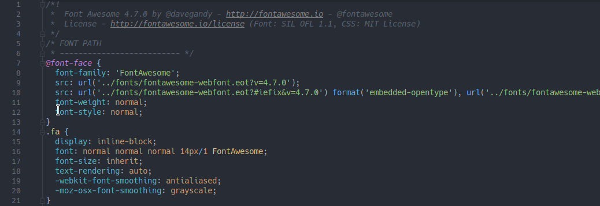
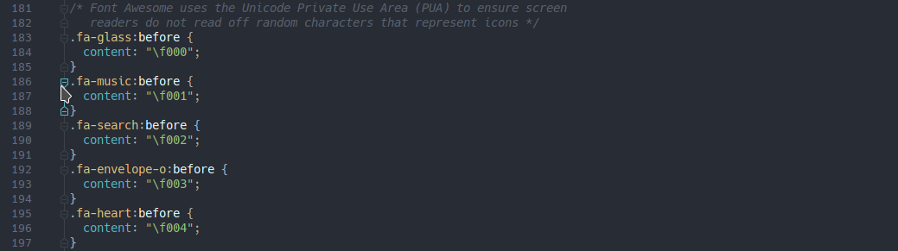
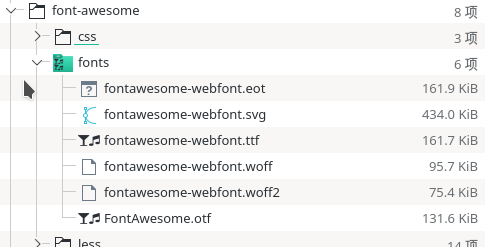
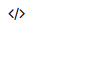
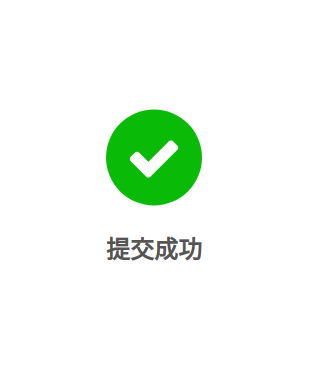

# 通过重现css更有效地使用Font Awesome

#### 引言

其实这回当了标题党，本文讨论的是通过自己实现css来局部加载Font Awesome字体图标，Font Awesome就不用说了，简称fa，非常流行的字体图标库，但是说实在话，font-awesome.css压缩完了也有30KB，不能算小了，有时只用几个图标，却要把上千个图标全部引进来，真的不是很环保（笑），所以我们通过重现Font Awesome的css流程（其实是闲得蛋疼），写一个简化的font-awesome来做到按需加载。到后面我们也会发现其原理也很简单，收拾完了就一字体组，每个字都有一个编号，我们之后就会认识到Font Awesome其实就是字体
<!-- more -->
#### Font Awesome到底干了什么

我手头的font-awesome.css版本是4.7.0，让我们掀开fa的裙子看看里面到底有什么大宝贝


一段使用fa的典型html骨架：

```html
<i class="fa fa-music"></i>
```

翻看font-awesome.css源码的第7行到21行：



以及183行到197行的一众fa-xxx类实现：



看到这里我们就基本明白了fa的实现流程了，fa将自己打包的字体封装成一个字体族FontAwesome（源码第8行），需要使用fa的html元素使用这个封装好的字体（源码第16行），如此设置过后，就可以在.fa元素里使用字符编码来显示对应的字体图标了。如此不难看出，字体图标本体其实就是一个数字文本

#### 重现样式

既然知道了实现流程，那我们就可以复现这一过程来创建自己的字体库

###### 1. 获取Font Awesome

首先就是下载Font Awesome，官网下也好，npm也好，我这里直接从npm下载了：

```shell
$ npm install font-awesome --save
```
> 要下完整包，不是单个的压缩过的css文件，因为我们之后需要其中的font文件

###### 2. 导入fa的字体

在fa的文件夹中找到对应的字体文件，也就是font文件夹下的6个文件，复制我们的项目中:



在css文件中，使用这些字体文件创建我们自己的font-family：
```css
@font-face {
    font-family: 'FontAwesome';
    src: url('fonts/fontawesome-webfont.eot?v=4.7.0');
    src: url('fonts/fontawesome-webfont.eot?#iefix&v=4.7.0') format('embedded-opentype'),
         url('fonts/fontawesome-webfont.woff2?v=4.7.0') format('woff2'),
         url('fonts/fontawesome-webfont.woff?v=4.7.0') format('woff'),
         url('fonts/fontawesome-webfont.ttf?v=4.7.0') format('truetype'),
         url('fonts/fontawesome-webfont.svg?v=4.7.0#fontawesomeregular') format('svg');
    font-weight: normal;
    font-style: normal;
}
```
> 注意修改正确的路径

###### 3. 查找图标代码

比如我们需要使用fa-code这个字体，那我们就到font-awesome.css文件中查找对应的代码：
```css
/* 在font-awesome.css-4.7.0的985行找到了这个字体图标的代码，\f121就是我们的图标编号 */
.fa-code:before {
  content: "\f121";
}
```

###### 4. 创建样式

获取到代码后就可以创建我们自己的字体样式了，很简单，使用之前用fa字体创建的font-family就行，只要一行：
```css
.icon {
    font-family: FontAwesome,serif;
}
```
在代码中引用我们自己的字体图标也很简单，只需稍微修改一下前缀，实例如下：
```html
/* \f121对应的html转义是&#xf121 */
<span class="icon">&#xf121</span>
```
效果如下（有点小，因为还没有任何额外样式）：



至此我们自己实现的简单的Font Awesome就完成了，现在按需加载相关图标，减少了传输体积，但是font文件还是没变，如果你够猛也可以自己裁剪字体文件手绘svg，进一步减少体积

#### 使用我们的字体库

通过之前的操作我们已经完成了一个简单的fa，但是离实际使用还是有些差距的，比如没有fa-spin来提供旋转效果，所以用之前需要完善一下代码，但我们其实已经可以知道，fa本质就是字体，字体图标本质就是文本，所以我们很轻松就可以写出一些功能和效果，类似这么一个移动布局中常见的提示图案：



在之前的基础上再稍加一些代码就可，完整代码如下：
```css 
// style.css
@font-face {
    font-family: 'FontAwesome';
    src: url('fonts/fontawesome-webfont.eot?v=4.7.0');
    src: url('fonts/fontawesome-webfont.eot?#iefix&v=4.7.0') format('embedded-opentype'),
         url('fonts/fontawesome-webfont.woff2?v=4.7.0') format('woff2'),
         url('fonts/fontawesome-webfont.woff?v=4.7.0') format('woff'),
         url('fonts/fontawesome-webfont.ttf?v=4.7.0') format('truetype'),
         url('fonts/fontawesome-webfont.svg?v=4.7.0#fontawesomeregular') format('svg');
    font-weight: normal;
    font-style: normal;
}

.icon {
    font-family: FontAwesome,serif;
    display: inline-block;
    text-align: center;
}

.icon-check {
    display: block;
    margin: 0 auto;
    width: 6rem;
    height: 6rem;
    line-height: 6rem;
    font-size: 3.5rem;
    border-radius: 50%;
    background: #09BB07;
    color: #fff;
}

#container {
    position: absolute;
    top: 50%;
    transform: translateY(-50%);
    width: 100%;
}

.check-message {
    font-family: "Lucida Sans", Verdana, Arial, sans-serif;
    font-weight: 600;
    font-size: 1.5rem;
    color: #555555;
    text-align: center;
}
```
```html
<!doctype html>
<html lang="en">
<head>
    <meta charset="UTF-8">
    <meta name="viewport"
          content="width=device-width, user-scalable=no, initial-scale=1.0, maximum-scale=1.0, minimum-scale=1.0">
    <meta http-equiv="X-UA-Compatible" content="ie=edge">
    <title>test-icon</title>

    <!-- 导入样式 -->
    <link rel="stylesheet" href="css/style.css">

</head>
<body>

<div id="container">
    <!-- 使用字体图标 -->
    <span class="icon icon-check">&#xf00c</span>
    <p class="check-message">提交成功</p>
</div>

</body>
</html>
```
> 时刻注意，字体图标的本质始终是文字

#### 总结

在本文中我们简单复现了fa，想看完整案例的旁友可以戳我的仓库[css-building-blocks](https://github.com/bladeXue/css-building-blocks)，如果你发现了问题或者有自己的想法，可以提issue或者在评论区戳我