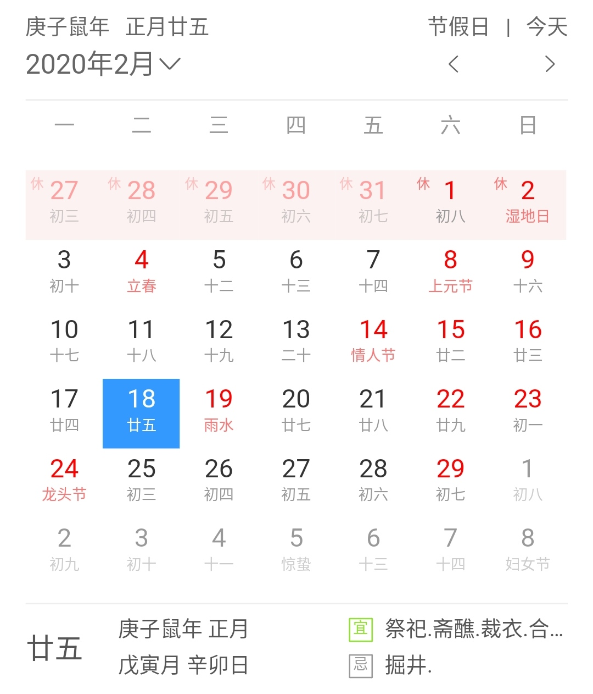
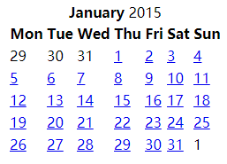
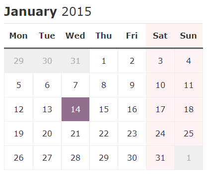

# CSS小积木-基于表格元素创建一个日历表

#### 构建日历表

日历表是一个非常常见的前端组建，无论是在博客系统中还是后台管理系统中都非常有用，尤其是在系统文章过多时，日历表配合时间线可以很好组织历史信息。本文使用\<table>作为日历表的html骨架，在实际应用中自然可以使用div堆叠或者其它结构，但是\<table>的可读性是最佳的
<!-- more -->
#### 表格的基础HTML结构
```html
<table id="tab">
    <tr>
        <th>name</th>
        <th>age</th>
        <th>sex</th>
    </tr>
    <tr>
        <td>xuezhijian</td>
        <td>22</td>
        <td>male</td>
    </tr>
</table>
```

表格元素的可选项：

- \<caption>：表题是可选的，经常用于显示当前信息
- \<thead>\<tbody>\<tfoot>：是语义标签，没有实意，其中\<tfoot>会被放到表格最底层
- \<col>和\<colgroup>：用于约束一整列元素，属于“替身使者”，作用在某一个\<col>上的元素会被应用到整列

表格专用的样式：

- border-collapse：用于控制表格的单元格之间的空隙，建议设为collapse
- table-layout：控制单元格向第一行看齐，设置fixed使得表格第一行申明的列宽具有绝对性，后续行如遇内容过多，只能折行或者溢出

#### 日历表的设计

|                         百度日历                         |                      原始日历表                       |
| ------------------------------------------------------- | ---------------------------------------------------- |
|  |  |

观察百度日历的样式，得出以下可以改进设计的地方：

- 醒目的表头：表头应该有独立样式，且用横线（如border-bottom）来和表体隔开，而且在职能上应该有更多的信息（如配合js显示为当前日期）
- 表的尺寸：不可以挤满整行，影响观感，设置max-width
- 单元格的尺寸：原始表的单元格过于拥挤，要设置合理的宽高，来使得单元格更加饱满，方便显示其中的数据。而且单元格缺少边框之类的视觉参照物
- 好看的字体：字体好看很重要，同时去掉下划线
- 染色：今天，周末，非本月，都要有单独的染色
#### 源码收录-日历表
html骨架代码：
```html
<table class="cal">
    <caption><strong>January</strong> 2015</caption>
    <colgroup>
        <col class="cal-mon">
        <col class="cal-tue">
        <col class="cal-wed">
        <col class="cal-thu">
        <col class="cal-fri">
        <col class="cal-sat cal-weekend"><!-- 应用在col上的样式会映射到整列上 -->
        <col class="cal-sun cal-weekend"><!-- 是很方便的操作 -->
    </colgroup>
    <thead>
        <tr>
            <th scope="col">Mon</th>
            <th scope="col">Tue</th>
            <th scope="col">Wed</th>
            <th scope="col">Thu</th>
            <th scope="col">Fri</th>
            <th scope="col">Sat</th>
            <th scope="col">Sun</th>
        </tr>
    </thead>
    <tbody>
        <tr>
            <td class="cal-inactive">29</td><!-- 非本月的日子要用淡色染色 -->
            <td class="cal-inactive">30</td><!-- 而且鼠标要设置disabled -->
            <td class="cal-inactive">31</td><!-- 在html上也去掉<a> -->
            <td><a href="#">1</a></td>
            <td><a href="#">2</a></td>
            <td><a href="#">3</a></td>
            <td><a href="#">4</a></td>
        </tr>
        <tr>
            <td><a href="#">5</a></td>
            <td><a href="#">6</a></td>
            <td><a href="#">7</a></td>
            <td><a href="#">8</a></td>
            <td><a href="#">9</a></td>
            <td><a href="#">10</a></td>
            <td><a href="#">11</a></td>
        </tr>
        <tr>
            <td><a href="#">12</a></td>
            <td><a href="#">13</a></td>
            <td><a href="#">14</a></td>
            <td><a href="#">15</a></td>
            <td><a href="#">16</a></td>
            <td><a href="#">17</a></td>
            <td><a href="#">18</a></td>
        </tr>
        <tr>
            <td><a href="#">19</a></td>
            <td><a href="#">20</a></td>
            <td><a href="#">21</a></td>
            <td><a href="#">22</a></td>
            <td><a href="#">23</a></td>
            <td><a href="#">24</a></td>
            <td><a href="#">25</a></td>
        </tr>
        <tr>
            <td><a href="#">26</a></td>
            <td class="cal-current"><a href="#">27</a></td><!-- 当前日子需要特殊染色，而且是最醒目的 -->
            <td><a href="#">28</a></td>
            <td><a href="#">29</a></td>
            <td><a href="#">30</a></td>
            <td><a href="#">31</a></td>
            <td class="cal-inactive">1</td>
        </tr>
    </tbody>
</table>
```
样式代码收录：
```CSS
.cal {
    border-collapse: collapse;
    table-layout: fixed;
    width: 100%;
    max-width: 25em;
    font-family: "Lucida Grande", Verdana, Arial, "Helvetica Neue", Helvetica, sans-serif;
    text-align: center;
}
.cal caption {
    text-align: left;
    border-bottom: 1px solid #ddd;
    line-height: 2;/* 2倍于em */
    font-size: 1.5em;
}
.cal-weekend {
    background-color: #fef0f0;
    background-color: rgba(255, 0, 0, 0.05);/* 应用一些透明度，这是一种兼容性写法 */
}
.cal th,
.cal td {
    line-height: 3;
    padding: 0;
    width: 14.285%;
}
.cal td {
    border: 1px solid #eee;/* 给单元格加上边框，增加辨识度 */
}
.cal thead {
    border-bottom: 3px solid #666;
}
.cal a {
    display: block;/* 调整为块元素，它就会撑满整个单元格，增加点击区域 */
    text-decoration: none;
    color: #2f273c;
}
.cal a:hover,
.cal a:focus {
    background-color: #cde7ca;/* 这里有3种染色，分别针对非本月，当前日，备选日，加上之前的周末一共4种染色 */
    background-color: rgba(167, 240, 210, 0.3);
}
.cal-inactive {
    background-color: #efefef;
    color: #aaa;
    cursor: not-allowed;
}
.cal-current {
    background-color: #7d5977;
    background-color: rgba(71, 14, 62, 0.6);
    color: #fff;
}
.cal-current a {
    color: #fff;
}
```
效果截图：



#### 文章参考

[精通CSS：高级Web标准解决方案（第3版）](https://www.ituring.com.cn/book/1910?tdsourcetag=s_pctim_aiomsg)

