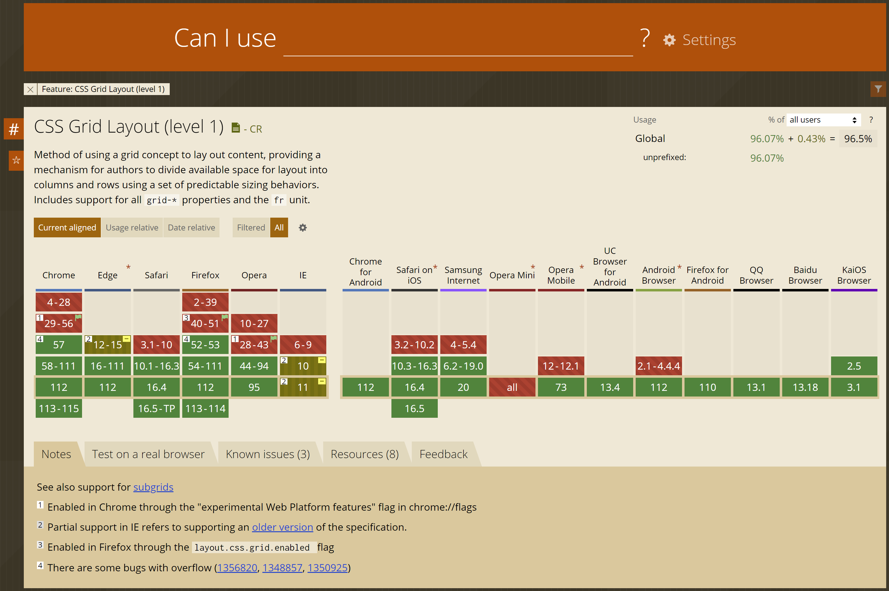
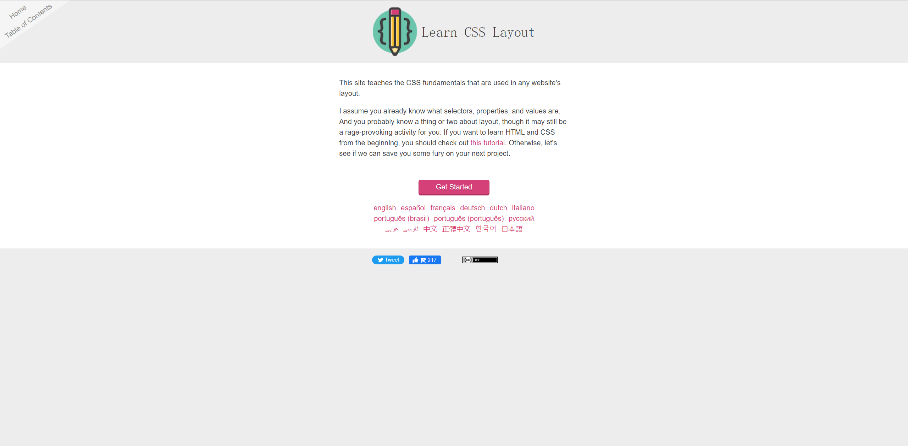

# CSS的技巧

本篇收录了对CSS的常识和代码片段，以及一些有用的资源，方便在实际开发时快速复用和查询。

> 本文更多地讨论现代CSS，对于CSS2时代的一些做法不予讨论。

## 关于CSS标准

现行的标准为2011发表的CSS3，其实际在开发上的标准可以参考MDN的[CSS 参考](https://developer.mozilla.org/zh-CN/docs/Web/CSS/Reference)。不同浏览器的CSS引擎在实现上五花八门，在日常开发中想写出兼容性代码可能是件很头疼的事情，可以多查询[Can I use...](https://caniuse.com/)。

实际开发时建议以MDN和Chrome的CSS规范为实际标准，编写**最小化代码**，因为CSS因为兼容性写法的存在，很容易变得很长，尽量在可控范围内写最短的代码，并只附加必要的兼容性代码。

## 关于CSS框架

CSS有很多流行的开发框架，如`bootstrap`和`material`。虽然这些流行库很漂亮很稳定，但通常会耦合某一个JavaScript框架，且通常代码过于复杂，想针对自己的UI进行修改工作量较大，所以还是建议自己维护一套常用的CSS样式库。

## 关于布局

> 布局是CSS最重要的部分，因为它会直接决定页面元素的整体排列。

CSS中布局的概念很大程度上来自出版业（尤其是[报纸](https://en.wikipedia.org/wiki/Newspaper)）的[排版](https://en.wikipedia.org/wiki/Typesetting)技术

如果是新手，建议先阅读来自[Greg Smith](https://incompl.com/)的学习布局教程[learnlayout](https://github.com/incompl/learnlayout)，这是一份很不错的布局样式入门指南。我在本篇的`source/learnlayout/`目录下备份了这个教程的原始仓库的快照和两份编译后的站点源码，也可以浏览项目站址[learnlayout.com](https://learnlayout.com/)。

## 重制样式

## 按钮样式

## 关于格式

参考SMACSS的[Formatting Code](http://smacss.com/book/formatting)章节，编写实际代码时可以参考。

## 盒子类样式

1. `Box`：`display`，`width/height`，`float`，`clear`，`position`，`top/bottom/left/right`，`cursor`，`z-index`。
2. `Border`：`border`，`border-radius`，`border-image`，`box-shadow`。
3. `Background`：
4. `Text`：
5. `Others`：

## 压缩和打包器

## 关于JavaScript

## 关于工程化

## 关于reset

## 关于页面元素

## 关于选择器

## 总结

## 参考
