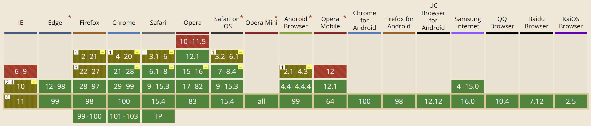
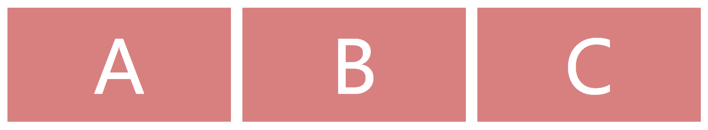
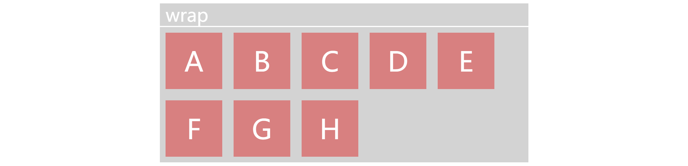
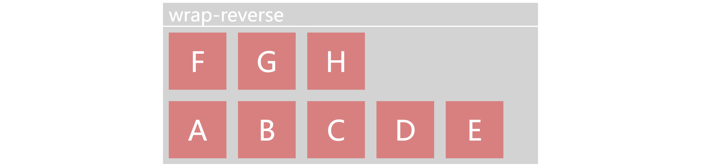
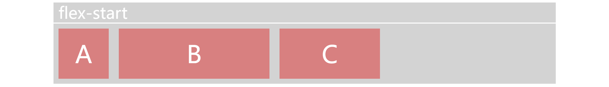
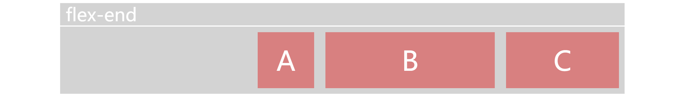
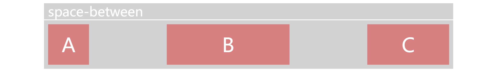
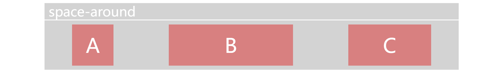
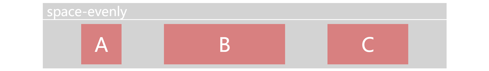
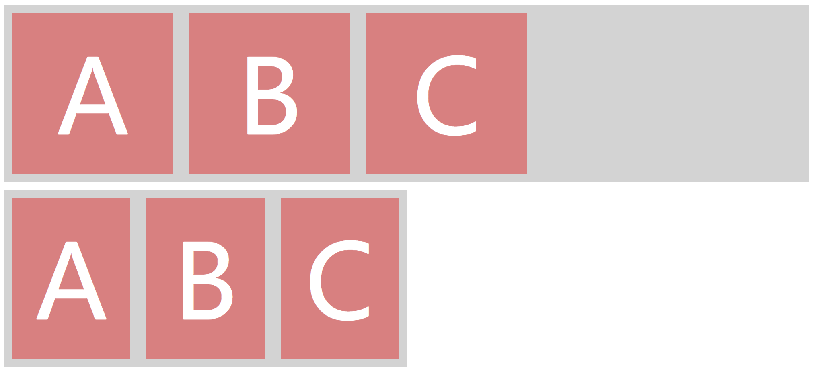

# 弹性布局

## 概念

弹性布局是目前最成熟，支持最好的，开发体验最友好的布局方案。传统的**定位布局**和**浮动布局**需要编写冗长的栅格系统来达到布局需求，但是2009年，W3C提出弹性布局，很多旧的样式，用弹性布局代码几行就写完了。

此外弹性布局可以轻松实现垂直居中（感天动地，前端终于有一个方便的垂直居中方案了）。

## 浏览器支持

2009年的时候，W3C就提出了**弹性布局**这个概念，但是当时不叫这个名字，当时使用的样式是`display: box`。2011年之后，谷歌一众浏览器厂商采用`display: flexbox`的兼容写法来实现弹性布局，2016年最终由W3C敲定为`display: flex`的Flex布局规范标准。所以弹性布局到今天经历了十多年，已经非常成熟了，且浏览器支持非常好。[CAN I USE](https://caniuse.com/?search=flex)的结果如下：



兼容性非常棒，基本全是绿的，也就当考虑IE10的时候要加个前缀。如果你不考虑兼容蛋疼的IE8，那么光速使用Flex改写布局系统是个很不错的方案。

> Grid布局的效果比Flex更强，但是Grid的浏览器支持目前还差点意思。

## 一些概念

### 1. 弹性容器和弹性盒子

弹性布局是CSS3中的一种布局方式，和传统的布局方式不同的是，弹性布局不再指定一个元素具体的尺寸，而是描述这个元素该如何去填充空间。这样做会把布局变得简单，我们只需要在样式中提出布局的需求，然后由浏览器计算具体的数值。

一个Flex布局由**弹性容器**和**弹性盒子**（也叫**弹性项目**或者**弹性个体**）构成，将一个父盒子指定成弹性容器后，其子项自动变成弹性盒子，随后会有：

1. 弹性容器默认宽度100%。
2. 横向布局的块级盒子不再占用单行。
3. 弹性盒子的尺寸可以随着容器大小而伸展或压缩，盒子原本的`float`，`clear`和`vertical-align`将会失效，相关效果由弹性容器接管。
4. 可以控制多个弹性盒子的排列顺序，对齐等等。

### 2. 弹性轴

弹性容器默认存在两根轴：主轴和交叉轴。横向布局中，主轴默认是水平轴，弹性元素按该轴**线性排列**。其实我们控制弹性布局的过程，就是在不断重排弹性轴的各种属性。


> 记住这张图，使用Flex时会反复提到轴和起点。

## 属性

将一个元素的`display`设置为`flex`或`inline-flex`即可将其设置为弹性容器，其子元素自动成为弹性盒子。Flex容器拥有4个主属性，Flex盒子拥有3个主属性，本质上就是在不断对齐和瓜分容器的**主轴**和**交叉轴**，他们的**默认值样式**看起来会长这样：

```css
.flex-container {
    /* display: flex | inline-flex; */        
    flex-flow: row nowrap;          /* 选择主轴 */
    justify-content: flex-start;    /* 主轴的对齐 */
    align-items: stretch;           /* 交叉轴的对齐 */        
    align-content: stretch;         /* 多根主轴时的对齐方案 */        
}
.flex-item {
    flex: 0 1 auto;                 /* 分配主轴空间 */
    order: 0;                       /* 主轴的个性 */    
    align-self: auto | stretch;     /* 交叉轴的个性 */
}
```

### 0. display

设置元素的`display: flex`生成**块级Flex容器**，设置`display: inline-flex`可以生成**内联Flex容器**。一个典型的弹性布局结构如下：

```HTML
<!-- HTML -->
<div class="flex-container">
    <div class="flex-item box">A</div>
    <div class="flex-item box">B</div>
    <div class="flex-item box">C</div>
</div>
<style>
    .flex-container {
        /* 设置弹性容器 */
        display: flex;
    }
    .flex-item {
        /* 弹性盒子样式 */
        flex: 1;
    }
    .box {
        /* 让盒子长好看点 */
        margin: 10px;
        height: 200px;
        background-color: lightcoral;
        text-align: center;
        color: white;
        font-size: 8em;
        line-height: 200px;
    }
</style>
```

效果：



### 1. flex-flow

`flex-flow`作用于容器，控制**布局流**，也就是弹性容器的主轴方向和是否换行，实际上由两个属性`flex-direction`和`flex-wrap`组成，默认为`row nowrap`，签名如下：

```css
flex-flow: [ row|row-reverse|column|column-reverse nowrap|wrap|wrap-reverse ] | initial | inherit
```

`flex-direction`的4种效果：


`flex-wrap`的3种效果：





### 2. justify-content

弹性容器中最强大最复杂的属性，控制子元素之间的距离。这个属性差不多就是Flex专属的`text-align`，负责当主轴空间剩余时，调整弹性盒子们在剩下的空间中对齐的位置，默认为`flex-start`，也就是朝**main-start**（主轴起点）的位置挤一块儿。其样式签名的简写如下：

```css
justify-content: flex-start | flex-end | center | space-between | space-around | space-evenly | initial | inherit;
```

> 这个样式的签名其实超级长，因为它除了Flex，还可以控制Grid，详情可以参考MDN的[justify-content](https://developer.mozilla.org/zh-CN/docs/Web/CSS/justify-content#overflow-position).

`justify-content`的6种常见效果：








### 3. align-items

`align-items`控制元素在交叉轴方向上的对齐效果，默认为`stretch`，适用两种情况：

1. 子元素高度不一。
2. 子元素没有撑满单行高度。

`align-items`的样式签名：

```css
align-items: baseline | center | flex-start | flex-end | stretch | initial | inherit
```


### 4. align-content

`align-items`可以针对元素在交叉轴方向上的高度进行对齐，当出现多根轴线时（比如你应用了`flex-wrap: wrap`，容器内的元素出现了换行），多根轴线之间的距离分配就出现了新问题，这个时候可以用`align-content`来控制这种交叉轴方向上的多轴对齐问题。


### 5. flex

`flex`属性作用于弹性盒子，指定了元素的**实际宽度**控制权。`flex`其实是3个属性的合体：

```css
/* 完整样式签名 */
flex: [ flex-grow flex-shrink flex-basis ] | none | auto | initial | inherit
```

> 你可以把它们写开，但我习惯把它们写在一起，即使当前弹性布局不使用`flex`，我也会把默认值抄上。这样可以避免出现意外值。

1. `flex-grow`：伸展权重，当弹性容器的空间富余时，按照此数值拉伸各个元素，默认为0。
2. `flex-shrink`：收缩权重，当弹性盒子的总宽度溢出容器时，按照此数值压缩各个元素，默认为1。
3. `flex-basis`：基准宽度，弹性容器会随意修改弹性盒子的宽度，所以原本盒子模型的`width`经常失效，我们用`flex-basis`替代（但是你可以把width也写上），默认为auto。

这里我们写点代码，先尝试设置一个容器，然后塞3个`flex-basis`为200px的盒子，将`flex-grow`设置为0，`flex-shrink`设置为1，分别将容器的`width`设置为1000px和500px，结果一个不变，一个收缩，如下：

```html
<!-- HTML -->
<div class="flex-container bg1">
    <div class="flex-item box">A</div>
    <div class="flex-item box">B</div>
    <div class="flex-item box">C</div>
</div>
<div class="flex-container bg2">
    <div class="flex-item box">A</div>
    <div class="flex-item box">B</div>
    <div class="flex-item box">C</div>
</div>
<!-- CSS -->
<style>
    .flex-container {
        /* 设置弹性容器 */
        display: flex;
    }
    .flex-item {
        /* 弹性盒子样式 */
        /* 这三行等同于flex: 0 1 200px */
        flex-grow: 0;
        flex-shrink: 1;
        flex-basis: 200px;
    }
    .box {
        /* 让盒子长好看点 */
        margin: 10px;
        height: 200px;
        background-color: lightcoral;
        text-align: center;
        color: white;
        font-size: 8rem;
        line-height: 200px;
    }
    .bg1 {
        width: 1000px;
        background-color: lightgray;
        margin-bottom: 10px;
    }
    .bg2 {
        width: 500px;
        background-color: lightgray;
    }
</style>
```



### 6. order


### 7. align-self


## 案例


## 总结

## 参考

[Flexbox Froggy - 一个用来学CSS flexbox的游戏](https://flexboxfroggy.com/#zh-cn)
