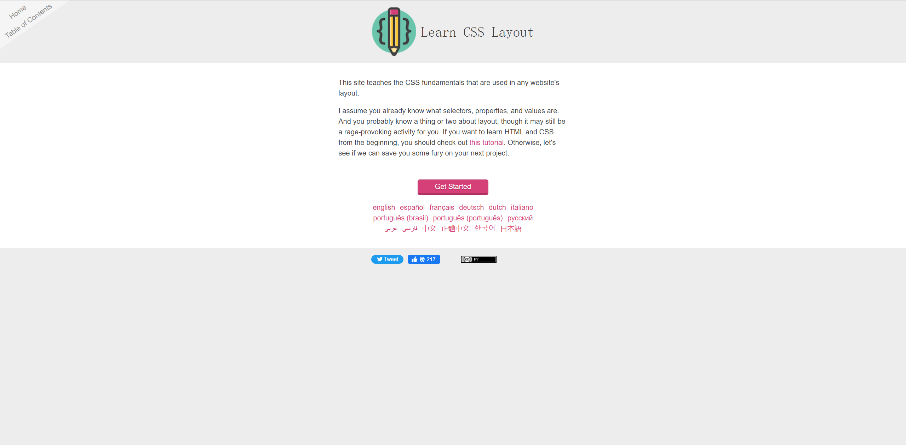

# 学习布局

本篇收录了一份教程，来自[Greg Smith](https://incompl.com/)的仓库[learnlayout](https://github.com/incompl/learnlayout)（我在`source/`目录下收录了这个仓库的快照和两份编译后的站点源码），浏览站址[learnlayout.com](https://learnlayout.com/)，这是一份很不错的样式布局入门指南。

