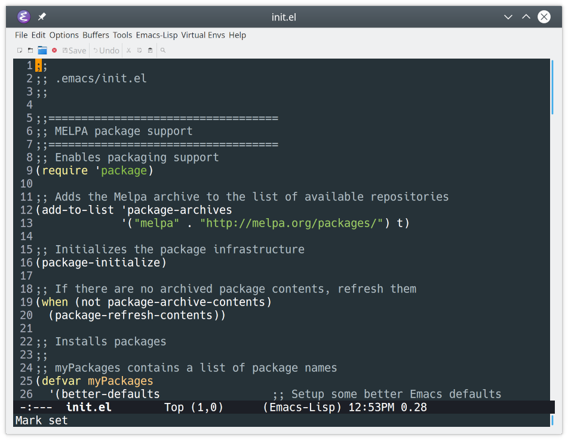
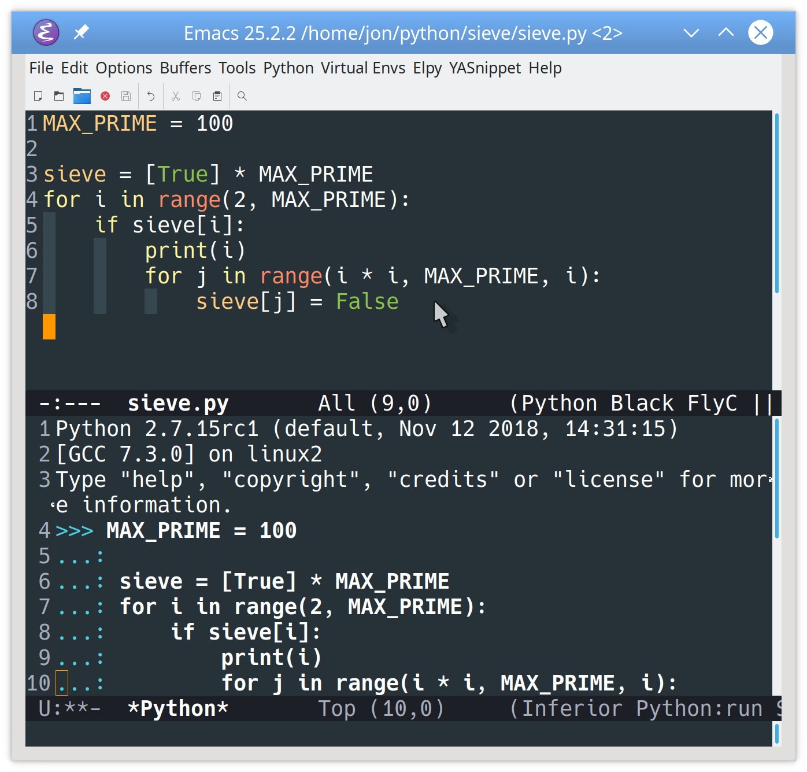
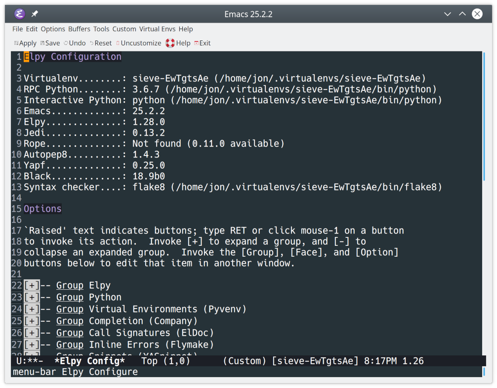
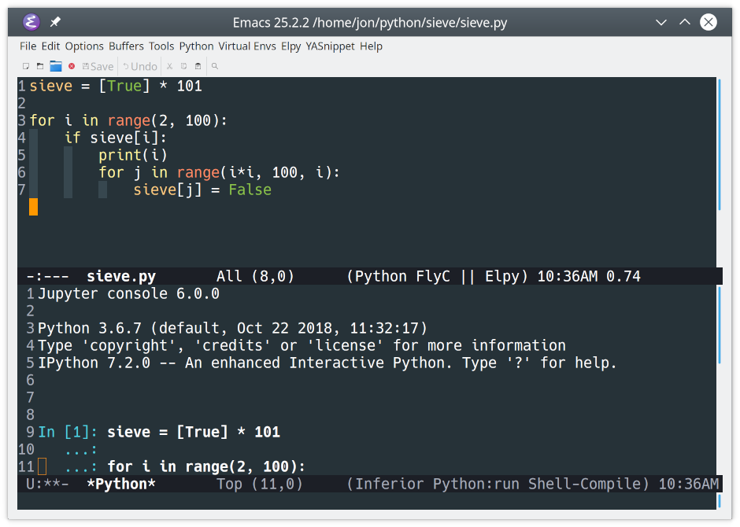
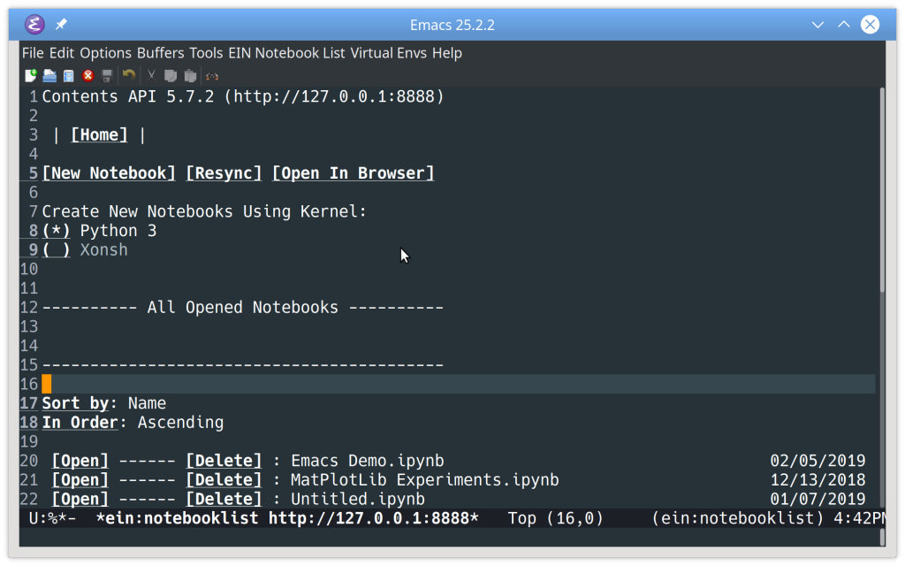
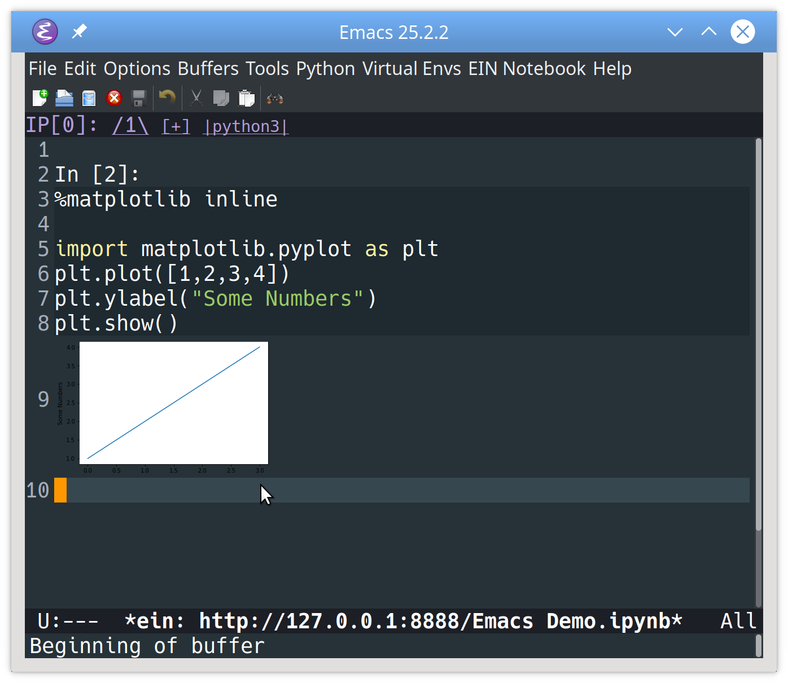
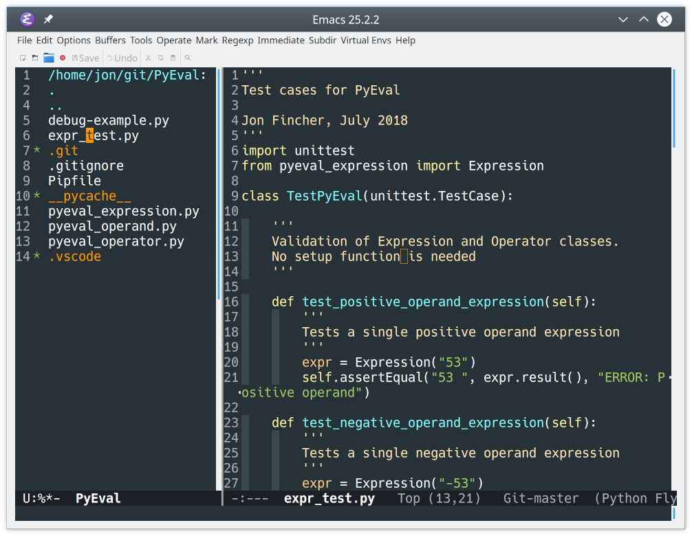
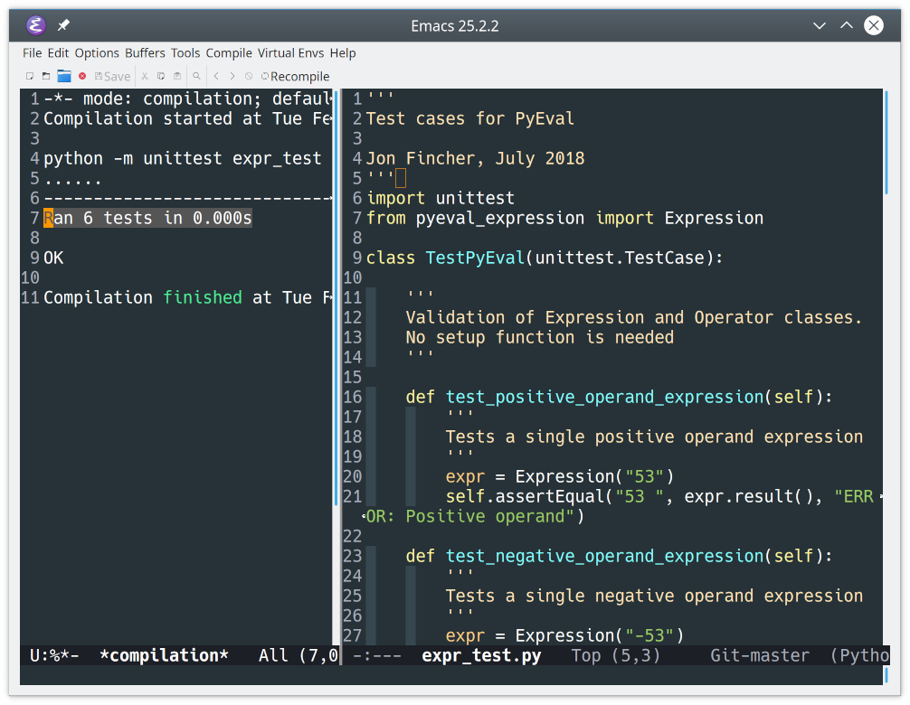
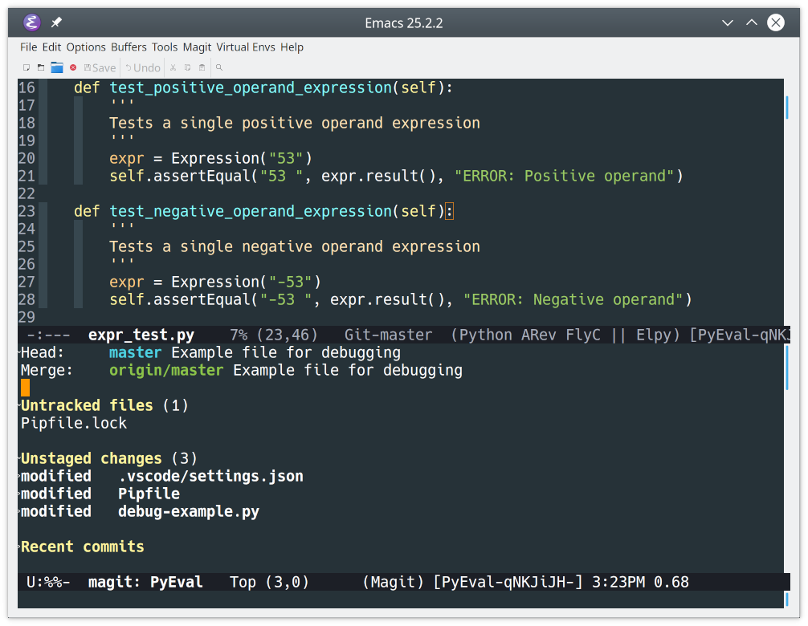
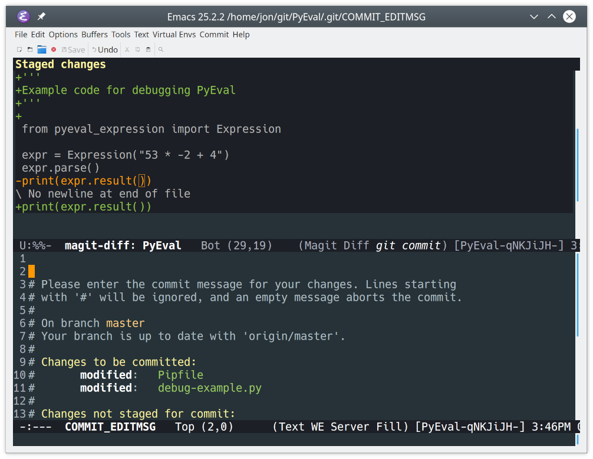

> 本篇原文来自[realpython.com](https://realpython.com/)的文章[Emacs: The Best Python Editor?](https://realpython.com/emacs-the-best-python-editor/)，略有魔改，本仓库目录下的[`EN.md`](./EN.md)为英文原版复制，[`archives/`](./archives/)目录中存放了[原版参考代码](https://github.com/realpython/materials/tree/master/emacs-the-best-python-editor)的一个快照，其中提供了一个结构合理风格良好的配置文件。如果你在本文中发现了任何版权问题请立刻联系作者(ノへ￣、)
>
> 下面是译文：

# Emacs：最好的Python编辑器？

你可以在下面的链接中找到本教程引用的所有文件：

> 戳[这里](https://github.com/realpython/materials/tree/master/emacs-the-best-python-editor)获取原文仓库代码

## 安装和基础

众所周知Emacs是一个很值得学习的编辑器，在开始探索Emacs的所有潜能，并将其全部释放在Python开发之前，你需要先完成安装Emacs并学习一些基础操作。

### 安装

在正式安装Emacs之前，要先选择自己的平台和Emacs发行版。[ErgoEmacs](http://ergoemacs.org/)提供的这篇[指南](http://ergoemacs.org/emacs/which_emacs.html)，提供了你在诸如Linux，Mac和Windows等不同系统上部署并运行一个初始版Emacs的一切知识。

安装完毕后，你就可以第一次启动Emacs了，你应该会看到这样一个默认启动界面：


### Emacs基础

在你正式开始用Emacs进行愉快的Python之旅之前，让我们先用几个例子来快速熟悉一下Emacs的基础操作。你可以了解到在初始配置的Emacs下编写代码是如何一个体验，以及初始配置下Emacs内置了多少针对Python编程的功能。打开你的Emacs，通过以下步骤创建一个简单的Python程序：

1. 按下`Ctrl`+`X` `Ctrl`+`F`来打开一个新文件。
2. 输入`sieve.py`来对文件进行命名。
3. 按下`Enter`键。
4. Emacs可能会要你二次确认，如果这样就再按一次`Enter`键。

现在输入下面的代码：

```python
MAX_PRIME = 100

sieve = [True] * MAX_PRIME
for i in range(2, MAX_PRIME):
  if sieve[i]:
    print(i)
      for j in range(i * i, MAX_PRIME, i):
        sieve[j] = False
```

你可能已经认出来了这个是[埃拉托斯特尼筛法](https://en.wikipedia.org/wiki/Sieve_of_Eratosthenes)的代码实现，这是一个检索给定区间内的素数的算法。在你输入这段代码的同时，你大概已经注意到了：

- Emacs以不同的高亮方式标记出了Python关键字和变量常量。
- Emacs在[for](https://realpython.com/courses/python-for-loop/)和[if](https://realpython.com/courses/python-conditional-statements/)语句后进行了自动缩进。
- 当你输入`Tab`时，Emacs切换了对齐方式，使得文本更加紧凑。
- 当键入右括号或括号时，Emacs都会突出显示左括号或括号。
- Emacs正常地响应了方向键（这点和Vim有所区别），`Enter`，`Backspace`，`Del`，`Home`，`End`和`Tab` 键也是一样。

但是Emacs中还是有一些“奇怪”的**键位**映射，比如当你想把别处的代码粘贴进Emacs时，习惯上你会使用标准的`Ctrl`+`V`快捷键，但你很快就会发现编辑器毫无反应。

对于初次接触Emacs，查询某个键位的作用，最简单的方式就是查询Emacs内置教程，直接把光标放置到Emacs启动界面上的Emacs Tutorial后按下`Enter`就可以访问，或是随时按下`Ctrl`+`H` `T`快捷键来迅速跳转。然后你应该会看到这么一段说明：

```text
Emacs commands generally involve the CONTROL key (sometimes labeled
CTRL or CTL) or the META key (sometimes labeled EDIT or ALT).  Rather than
write that in full each time, we'll use the following abbreviations:

 C-<chr>  means hold the CONTROL key while typing the character <chr>
          Thus, C-f would be: hold the CONTROL key and type f.
 M-<chr>  means hold the META or EDIT or ALT key down while typing <chr>.
          If there is no META, EDIT or ALT key, instead press and release the
          ESC key and then type <chr>.  We write <ESC> for the ESC key.

Important Note: to end the Emacs session, type C-x C-c.  (Two characters.)
To quit a partially entered command, type C-g.
```

看完这段字你大致就能理解了，Emacs中快捷键的记法形如C-x C-s。这个命令用于保存当前缓冲区的内容。这个记号释义为要同时按下`Ctrl`键和`X`键，然后再同时按下`Ctrl`键和`S`键。

> 提示：在本篇教程中，Emacs中的快捷键记为形如`Ctrl`+`X` `Ctrl`+`S`。

Emacs沿用了一些比较古老的术语，一路可以追溯到其当年诞生的UNIX文本时代的操作系统，由于这些术语可能和现在的主流用语有偏差，但Emacs还是保留了它们，为了方便阅读，最好还是先了解一下这些专有名词：

- 对Emacs来说，每次启动Emacs时你看到的窗口称为[frame（框架）](https://www.gnu.org/software/emacs/manual/html_node/elisp/Frames.html#Frames)，对操作系统来说则通常称之为**Window**或者**窗体**，但在Emacs中通常称呼为**框架**
- 每个Emacs框架所拥有的矩形区域通常被称为[windows（窗口）](https://www.gnu.org/software/emacs/manual/html_node/elisp/Windows.html#Windows)。每次启动时，Emacs会打开一个框架，并渲染一个窗口出来，但通过快捷键和命令，你可以在一个框架中打开多个窗口（分屏）
- 窗口负责待编辑的文本流显示出来，被称为[buffer（缓冲区）](http://www.gnu.org/software/emacs/manual/html_node/elisp/Buffers.html)。缓冲区是编辑的主体，也是你和Emacs交互的主要方式，缓冲区可以是打开的文件内容，也可以是命令行输出，一个菜单列表等等。
- 每个Emacs框架的底部都会有一小条预留位置，这个是让你输入命令和Emacs交互用的，通常称为[mini-buffer（微型缓冲区或者命令区）](https://www.gnu.org/software/emacs/manual/html_node/elisp/Minibuffers.html#Minibuffers)，通过`Ctrl`+`G`快捷键来清空和取消当前命令

现在你对Emacs的功能应该是有所了解了，但为了让Emacs成为真正的Python开发利器，还需要必要的客制化和配置。

### 启动配置

Emacs拥有众多的优点，但其中的佼佼者便是其丰富强大的配置选项，配置的核心便是[启动文件](http://www.gnu.org/software/emacs/manual/html_node/emacs/Init-File.html)，Emacs每次启动都会读取该文件进行初始化

这个文件由[Emacs Lisp](https://www.gnu.org/software/emacs/manual/html_node/eintr/index.html)脚本代码构成，并在每次启动时被Emacs执行。别被吓到了，客制化Emacs不需要你成为一个Lisp大师，但想精通Emacs，回头学习一些Lisp也很有用的。大部分客制化选项都会写在这个文件里。

启动的时候，Emacs依次会在[三个地方](https://www.gnu.org/software/emacs/manual/html_node/emacs/Find-Init.html#Find-Init)寻找相关配置：

1. 首先，Emacs会尝试翻查你用户家目录下的`.emacs`文件。
2. 如果该文件不存在，那么Emacs会继续在你的家目录里寻找`emacs.el`文件。
3. 最后如果这两个文件都没找到，Emacs则会尝试按照路径，读取家目录下的`.emacs.d/init.el`文件。

通常情况下，我们推荐使用第三种，也就是创建`.emacs.d/init.el`来作为配置文件的地址，如果你以前用过Emacs，你可能也会找到前两个，你也可以选择用它们来完成本篇教程，问题不大，但如果你想完全按照本文来，你可以删掉它们，改用`.emacs.d/init.el`

如果这是你第一次用Emacs，你可以需要手动创建`.emacs.d/init.el`，然后在你已经打开了的Emacs窗口中，操作以下步骤：

1. 按下`Ctrl`+`X` `Ctrl`+`F`。
2. 在命令区的提示符中输入`~/.emacs.d/init.el`。
3. 按下`Enter`确认。
4. 如果要二次确认，就再按一次`Enter`键。

和我们之前的操作类似，但这次让我们来回顾一下在这个操作中都干嘛了：

- 你按下了热键`Ctrl`+`X` `Ctrl`+`F`来告诉Emacs你想打开一个文件。
- You tell Emacs what file to open by giving it a path to the file. The path `~/.emacs.d/init.el` has three parts:
  1. The leading tilde `~` is a shortcut to your home folder. On Linux and Mac machines, this is usually `/home/<username>`. On Windows machines, it’s the path specified in the [HOME environment variable](http://www.gnu.org/software/emacs/manual/html_node/efaq-w32/Location-of-init-file.html#Location-of-init-file).
  2. The folder `.emacs.d` is where Emacs stores all its configuration information. You can use this folder to quickly set up Emacs on a new machine. To do so, copy the contents of this folder to your new machine, and Emacs is good to go!
  3. The file `init.el` is your initialization file.
- You tell Emacs, "Yes, I do want to create this new file." (This step is required since the file doesn’t exist. Normally, Emacs will simply open the file specified.)

After Emacs creates the new file, it opens that file in a new buffer for you to edit. This action doesn’t actually create the file yet, though. You must save the blank file using `Ctrl`+`X` `Ctrl`+`S` to create it on disk.

Throughout this tutorial, you’ll see initialization code snippets that enable different features. Create the initialization file now if you want to follow along! You can also find the complete initialization file at the link below:

> Download Code: [Click here to download the code you’ll use](https://github.com/realpython/materials/tree/master/emacs-the-best-python-editor) to learn about Emacs for Python in this tutorial.

### Customization Packages

Now that you have an initialization file, you can add customization options to tailor Emacs for Python development. There are a few ways you can customize Emacs, but the one with the fewest steps is adding [Emacs packages](https://www.gnu.org/software/emacs/manual/html_node/emacs/Packages.html). These come from a variety of sources, but the primary package repository is [MELPA](https://melpa.org/#/), or the **Milkypostman’s Emacs Lisp Package Archive**.

Think of MELPA as [PyPI](https://pypi.org/) for Emacs packages. Everything you need and will use in this tutorial can be found there. To begin using it, expand the code block below and copy the configuration code to your `init.el` file:

```lisp
;; .emacs.d/init.el

;; ===================================
;; MELPA Package Support
;; ===================================
;; Enables basic packaging support
(require 'package)

;; Adds the Melpa archive to the list of available repositories
(add-to-list 'package-archives
             '("melpa" . "http://melpa.org/packages/") t)

;; Initializes the package infrastructure
(package-initialize)

;; If there are no archived package contents, refresh them
(when (not package-archive-contents)
  (package-refresh-contents))

;; Installs packages
;;
;; myPackages contains a list of package names
(defvar myPackages
  '(better-defaults                 ;; Set up some better Emacs defaults
    material-theme                  ;; Theme
    )
  )

;; Scans the list in myPackages
;; If the package listed is not already installed, install it
(mapc #'(lambda (package)
          (unless (package-installed-p package)
            (package-install package)))
      myPackages)

;; ===================================
;; Basic Customization
;; ===================================

(setq inhibit-startup-message t)    ;; Hide the startup message
(load-theme 'material t)            ;; Load material theme
(global-linum-mode t)               ;; Enable line numbers globally

;; User-Defined init.el ends here
```

As you read through the code, you’ll see that `init.el` is broken into sections. Each section is separated by comment blocks that begin with two semicolons (;;). The first section is titled `MELPA Package Support`:

```lisp
;; .emacs.d/init.el

;; ===================================
;; MELPA Package Support
;; ===================================
;; Enables basic packaging support
(require 'package)

;; Adds the Melpa archive to the list of available repositories
(add-to-list 'package-archives
             '("melpa" . "http://melpa.org/packages/") t)

;; Initializes the package infrastructure
(package-initialize)

;; If there are no archived package contents, refresh them
(when (not package-archive-contents)
  (package-refresh-contents))
```

This section begins by setting up the packaging infrastructure:

- **Line 7** tells Emacs to use packages.
- **Lines 10 and 11** add the MELPA archive to the list of package sources.
- **Line 14** initializes the packaging system.
- **Lines 17 and 18** build the current package content list if it doesn’t already exist.

The first section continues from line 20:

```lisp
;; Installs packages
;;
;; myPackages contains a list of package names
(defvar myPackages
  '(better-defaults                 ;; Set up some better Emacs defaults
    material-theme                  ;; Theme
    )
  )

;; Scans the list in myPackages
;; If the package listed is not already installed, install it
(mapc #'(lambda (package)
          (unless (package-installed-p package)
            (package-install package)))
      myPackages)
```

At this point, you’re all set to programmatically install Emacs packages:

- **Lines 23 to 27** define a list of package names to install. You’ll add more packages as you progress through the tutorial:
  - **Line 24** adds [better-defaults](http://melpa.org/#/better-defaults). This is a collection of minor changes to the Emacs defaults that make it more user-friendly. It’s also a great base for further customization.
  - **Line 25** adds the [material-theme](http://melpa.org/#/material-theme) package, which is a nice dark style found in other environments.
- **Lines 31 to 34** traverse the list and install any packages that are not already installed.

> Note: You don’t need to use the Material theme. There are many different [Emacs themes](http://melpa.org/#/?q=theme) available on MELPA for you to choose from. Pick one that suits your style!

After you install your packages, you can move on to the section titled `Basic Customization`:

```lisp
;; ===================================
;; Basic Customization
;; ===================================

(setq inhibit-startup-message t)    ;; Hide the startup message
(load-theme 'material t)            ;; Load material theme
(global-linum-mode t)               ;; Enable line numbers globally

;; User-Defined init.el ends here
```

Here, you add a few other customizations:

- **Line 40** disables the initial Emacs screen containing the tutorial information. You may want to leave this commented out by using a double semicolon (;;) until you’re more comfortable with Emacs.
- **Line 41** loads and activates the Material theme. If you want to install a different theme, then use its name here instead. You can also comment out this line to use the default Emacs theme.
- **Line 42** displays line numbers in every buffer.

Now that you have a complete basic configuration file in place, you can save the file using `Ctrl`+`X` `Ctrl`+`S`. Then, close and restart Emacs to see the changes.

The first time Emacs runs with these options, it may take a few seconds to start as it sets up the packaging infrastructure. When that’s finished, you’ll see that your Emacs window looks a bit different:



After the restart, Emacs skipped the initial screen and instead opened the last active file. The Material theme is applied, and line numbers have been added to the buffer.

> Note: You can add packages interactively after the packaging infrastructure is set up. Hit `Alt`+`X`, then type `package-show-package-list` to see all the packages available to install in Emacs. As of this writing, there are over 4300 available.
> 
> With the list of packages visible, you can:
> 
> - Quickly filter the list by package name by hitting `F`.
> - View the details of any package by clicking its name.
> - Install the package from the package view by clicking the *Install* link.
> - Close the package list using `Q`.

## Emacs for Python Development With elpy

Emacs is ready out of the box to edit Python code. The library file `python.el` provides *python-mode*, which enables basic indentation and syntax highlighting support. However, this built-in package doesn’t provide much else. To properly compete with Python-specific [IDEs](https://realpython.com/python-ides-code-editors-guide/) (Integrated Development Environments), you’ll add more capabilities.

The [`elpy`](https://elpy.readthedocs.org/en/latest/) package (**Emacs Lisp Python Environment**) provides a near-complete set of [Python IDE features](https://elpy.readthedocs.org/en/latest/ide.html), including:

- Automatic indentation
- Syntax highlighting
- Auto completion
- Syntax checking
- Python REPL integration
- Virtual environment support

To install and `enable` elpy, you add the package to your Emacs configuration. The following change to `init.el` will do the trick:

```lisp
(defvar myPackages
  '(better-defaults                 ;; Set up some better Emacs defaults
    elpy                            ;; Emacs Lisp Python Environment
    material-theme                  ;; Theme
    )
  )
```

Once `elpy` is installed, you need to enable it. Add the following code just before the end of your `init.el` file:

```lisp
;; ====================================
;; Development Setup
;; ====================================
;; Enable elpy
(elpy-enable)

;; User-Defined init.el ends here
```

You now have a new section titled `Development Setup`. Line 49 enables `elpy`.

> Note: Unfortunately, Emacs will only read the contents of the initialization file once when it starts. If you make any changes to it, then the easiest and safest way to load them is to restart Emacs.

To see the new mode in action, go back to the [Sieve of Eratosthenes](https://en.wikipedia.org/wiki/Sieve_of_Eratosthenes) code you entered [earlier](https://realpython.com/emacs-the-best-python-editor/#basic-emacs). Create a new Python file and retype the Sieve code directly:

```python
MAX_PRIME = 100

sieve = [True] * MAX_PRIME
for i as range(2, MAX_PRIME):
  if sieve[i]:
    print(i)
    for j in range(i*i, MAX_PRIME, i):
      sieve[j] = False
```

Note the intentional [syntax error](https://realpython.com/invalid-syntax-python/) on line 4.

This is what your Python file would look like in Emacs:


Auto-indentation and keyword highlighting still work as before. However, you should also see an error indicator on line 4:


This error indicator pops up in the `for` loop when you typed `as` instead of `in`.

Correct that error, then type `Ctrl`+`C` `Ctrl`+`C` while in the Python buffer to run the file without leaving Emacs:



When you use this command, Emacs will do the following:

1. Create a new buffer named *\*Python\**
2. Open your Python interpreter and connect it to that buffer
3. Create a new window under your current code window to display the buffer
4. Send the code to the interpreter to execute

You can scroll through the *\*Python\** buffer to see which interpreter was run and how the code was started. You can even type commands at the prompt (>>>) at the bottom.

Often, you’ll want to execute your code in a [virtual environment](https://realpython.com/python-virtual-environments-a-primer/) using the interpreter and packages specified for that environment. Fortunately, `elpy` includes the [pyvenv](http://melpa.org/#/pyvenv) package, which provides built-in support for virtual environments.

To use an existing virtual environment in Emacs, type `Alt`+`X` `pyvenv-workon`. Emacs will ask for the name of the virtual environment to use and activate it. You can deactivate the current virtual environment with `Alt`+`X` `pyvenv-deactivate`. You can also access this functionality from the Emacs menu, under *Virtual Envs*.

You can also configure `elpy` from within Emacs. Type `Alt`+`X` `elpy-config` to display the following dialog:



You should see valuable debugging information, as well as options to configure `elpy`.

Now you’ve put all of the basics of using Emacs with Python in place. Time to put some icing on this cake!

## Additional Python Language Features

In addition to all of the basic IDE features described above, there are other syntax features you can use with Emacs for Python development. In this tutorial, you’ll cover these three:

1. Syntax checking with [flycheck](http://www.flycheck.org/)
2. Code formatting with [PEP 8](https://realpython.com/python-pep8/) and [black](https://pypi.org/project/black/)
3. Integration with Jupyter and IPython

This is not an exhaustive list, however! Feel free to play around with Emacs and Python to see what other syntax features you can discover.

### Syntax Checking

By default, `elpy` uses a syntax-checking package called [flymake](https://www.gnu.org/software/emacs/manual/html_node/flymake/index.html). While `flymake` is built into Emacs, it only has native support four languages, and it requires significant effort to be able to support new languages.

Luckily, there is a newer and more complete solution available! The syntax-checking package [flycheck](http://www.flycheck.org/) supports real-time syntax checking in over 50 languages and is designed to be quickly configured for new languages. You can read about the differences between `flymake` and `flycheck` in the [documentation](https://www.flycheck.org/en/latest/user/flycheck-versus-flymake.html).

You can quickly switch `elpy` to use `flycheck` instead of `flymake`. First, add `flycheck` to your `init.el`:

```lisp
(defvar myPackages
  '(better-defaults                 ;; Set up some better Emacs defaults
    elpy                            ;; Emacs Lisp Python Environment
    flycheck                        ;; On the fly syntax checking
    material-theme                  ;; Theme
    )
  )
```

`flycheck` will now be installed with the other packages.

Then, add the following lines in the `Development Setup` section:

```lisp
;; ====================================
;; Development Setup
;; ====================================
;; Enable elpy
(elpy-enable)

;; Enable Flycheck
(when (require 'flycheck nil t)
  (setq elpy-modules (delq 'elpy-module-flymake elpy-modules))
  (add-hook 'elpy-mode-hook 'flycheck-mode))
```

This will enable `flycheck` when Emacs runs your initialization file. Now you’ll see real-time syntax feedback whenever you use Emacs for Python code editing:


Notice the syntax reminder for [range()](https://realpython.com/python-range/), which appears at the bottom of the window as you type.

### Code Formatting

Love it or hate it, [PEP 8](https://www.python.org/dev/peps/pep-0008/) is here to stay. If you want to follow all or some of the standards, then you’ll probably want an automated way to do so. Two popular solutions are [autopep8](https://pypi.python.org/pypi/autopep8/) and [black](https://pypi.org/project/black/). These code formatting tools must be installed in your Python environment before they can be used. To learn more about how to install an auto-formatter, check out How to [Write Beautiful Python Code With PEP 8](https://realpython.com/python-pep8/#autoformatters).

Once the auto-formatter is available, you can install the proper Emacs package to enable it:

- **py-autopep8** connects `autopep8` to Emacs.
- **blacken** enables `black` to run from within Emacs.

You only need to install one of these in Emacs. To do so, add one of the following highlighted lines to your `init.el`:

```lisp
(defvar myPackages
  '(better-defaults                 ;; Set up some better Emacs defaults
    elpy                            ;; Emacs Lisp Python Environment
    flycheck                        ;; On the fly syntax checking
    py-autopep8                     ;; Run autopep8 on save
    blacken                         ;; Black formatting on save
    material-theme                  ;; Theme
    )
  )
```

If you’re using `black`, then you’re done! `elpy` recognizes the `blacken` package and will enable it automatically.

If you’re using `autopep8`, however, then you’ll need to enable the formatter in the `Development Setup` section:

```lisp
;; ====================================
;; Development Setup
;; ====================================
;; Enable elpy
(elpy-enable)

;; Enable Flycheck
(when (require 'flycheck nil t)
  (setq elpy-modules (delq 'elpy-module-flymake elpy-modules))
  (add-hook 'elpy-mode-hook 'flycheck-mode))

;; Enable autopep8
(require 'py-autopep8)
(add-hook 'elpy-mode-hook 'py-autopep8-enable-on-save)

;; User-Defined init.el ends here
```

Now, every time you save your Python code, the buffer is automatically formatted and saved, and the contents reloaded. You can see how this works with some badly formatted Sieve code and the `black` formatter:


You can see that after the file is saved, it’s reloaded in the buffer with the proper `black` formatting applied.

### Integration With Jupyter and IPython

Emacs can also work with Jupyter Notebooks and the IPython REPL. If you don’t already have Jupyter installed, then check out [Jupyter Notebook: An Introduction](https://realpython.com/jupyter-notebook-introduction/). Once Jupyter is ready to go, add the following lines to your `init.el` after the call to enable `elpy`:

```lisp
;; ====================================
;; Development Setup
;; ====================================
;; Enable elpy
(elpy-enable)

;; Use IPython for REPL
(setq python-shell-interpreter "jupyter"
      python-shell-interpreter-args "console --simple-prompt"
      python-shell-prompt-detect-failure-warning nil)
(add-to-list 'python-shell-completion-native-disabled-interpreters
             "jupyter")

;; Enable Flycheck
(when (require 'flycheck nil t)
  (setq elpy-modules (delq 'elpy-module-flymake elpy-modules))
  (add-hook 'elpy-mode-hook 'flycheck-mode))
```

This will update Emacs to use IPython rather than the standard Python REPL. Now when you run your code with `Ctrl`+`C` `Ctrl`+`C`, you’ll see the IPython REPL:



While this is pretty useful on its own, the real magic is in the Jupyter Notebook integration. As always, you need to add a bit of configuration to enable everything. The [`ein`](http://melpa.org/#/ein) package enables an IPython Notebook client in Emacs. You can add it to your `init.el` like so:

```lisp
(defvar myPackages
  '(better-defaults                 ;; Set up some better Emacs defaults
    elpy                            ;; Emacs Lisp Python Environment
    flycheck                        ;; On the fly syntax checking
    py-autopep8                     ;; Run autopep8 on save
    blacken                         ;; Black formatting on save
    ein                             ;; Emacs IPython Notebook
    material-theme                  ;; Theme
    )
  )
```

You can now start a Jupyter server and work with Notebooks from within Emacs.

To start the server, use the command `Alt`+`X` `ein:jupyter-server-start`. Then provide a folder in which to run the server. You’ll see a new buffer showing the Jupyter Notebooks available in the folder selected:



From here you can create a new Notebook with a selected kernel by clicking *New Notebook*, or open an existing Notebook from the list at the bottom by clicking *Open*:



You can complete the exact same task by typing `Ctrl`+`X` `Ctrl`+`F`, and then typing `Ctrl`+`C` `Ctrl`+`Z`. This will open the Jupyter Notebook directly in Emacs as a file.

With a Notebook open, you can:

- Move around the Notebook cells using the arrow keys
- Add a new cell above the current cell using `Ctrl`+`A`
- Add a new cell below the current cell using `Ctrl`+`B`
- Execute new cells using either `Ctrl`+`C` `Ctrl`+`C` or `Alt`+`Enter`

Here’s an example of how to move around a Notebook, add a new cell, and execute it:


You can save your work using `Ctrl`+`X` `Ctrl`+`S`.

When you’re done working in your notebook, you can close it using `Ctrl`+`C` `Ctrl`+`Shift`+`3`. You can stop the Jupyter server completely by hitting `Alt`+`X` `ein:jupyter-server-stop`. Emacs will ask you if you want to kill the server and close all open Notebooks.

Of course, this is just the tip of the Jupyter iceberg! You can explore everything the `ein` package can do in the [documentation](https://tkf.github.io/emacs-ipython-notebook/).

## Testing Support

Do you write perfect code that has no side-effects and performs well under all conditions? Of course… not! If this sounds like you, though, then you’re free to skip ahead a bit. But for most developers, testing code is a requirement.

`elpy` provides extensive support for running [tests](https://elpy.readthedocs.io/en/latest/ide.html#testing), including support for:

- [unittest](https://docs.python.org/3/library/unittest.html)
- [nose](https://nose.readthedocs.io/en/latest/)
- [pytest](https://docs.pytest.org/en/latest/)
- [green](https://pypi.org/project/green/)
- [Twisted’s trial](https://twistedmatrix.com/trac/wiki/TwistedTrial)
- [Django](https://realpython.com/python-testing/#how-to-use-the-django-test-runner)

To demonstrate the testing capabilities, the code for this tutorial includes a version of Edsger Dijkstra’s [shunting yard algorithm](https://en.wikipedia.org/wiki/Shunting-yard_algorithm). This algorithm parses mathematical equations that are written using infix notation. You can download the code at the link below:

> Download Code: [Click here to download the code you’ll use](https://github.com/realpython/materials/tree/master/emacs-the-best-python-editor) to learn about Emacs for Python in this tutorial.

To start, let’s get a more complete picture of the project by viewing the project folder. You can open a folder in Emacs using `Ctrl`+`X` `D`. Next, you’ll display two windows in the same frame by splitting the frame vertically with `Ctrl`+`X` `3`. Finally, you navigate to the test file in the left window, and click on it to open it in the right window:



The test file `expr_test.py` is a basic `unittest` file that contains a single test case with six tests. To run the test case, type `Ctrl`+`C` `Ctrl`+`T`:



The results are displayed in the left window. Notice how all six tests were run. You can run a single test in a test file by putting the cursor in that test before typing `Ctrl`+`C` `Ctrl`+`T`.

## Debugging Support

When tests fail, you’ll need to delve into the code to figure out why. The built-in *python-mode* allows you to use Emacs for Python code debugging with `pdb`. For an introduction to `pdb`, check out [Python Debugging with Pdb](https://realpython.com/python-debugging-pdb/).

Here’s how to use `pdb` in Emacs:

1. Open the `debug-example.py` file in the PyEval project.
2. Type `Alt`+`X` `pdb` to start the Python debugger.
3. Type `debug-example.py` `Enter` to run the file under the debugger.

Once it’s running, `pdb` will split the frame horizontally and open itself in a window above the file you’re debugging:


All debuggers in Emacs run as part of the [Grand Unified Debugger library](https://www.gnu.org/software/emacs/manual/html_node/emacs/Debuggers.html#Debuggers), also called the GUD. This library provides a consistent interface for debugging all supported languages. The name of the buffer created, *\*gud-debug-example.py\**, shows that the debug window was created by the GUD.

The GUD also connects `pdb` to the actual source file in the bottom window, which tracks your current location. Let’s step through this code to see how that works:


You can step through code in `pdb` using one of two keys:

1. `S` steps *into* other functions.
2. `N` steps *over* other functions.

You’ll see the cursor move in the lower source window to keep track of the execution point. As you follow function calls, `pdb` opens local files as required to keep you moving forward.

## Git Support

No modern IDE would be complete without support for source control. While numerous source control options exist, it’s a fair bet that most programmers are using [Git](https://git-scm.com/). If you’re not using source control, or need to learn more about Git, then check out [Introduction to Git and GitHub for Python developers](https://realpython.com/python-git-github-intro/).

In Emacs, source control support is provided by the [`magit`](http://magit.vc/) package. You install `magit` by listing it in your `init.el` file:

```lisp
(defvar myPackages
  '(better-defaults                 ;; Set up some better Emacs defaults
    elpy                            ;; Emacs Lisp Python Environment
    ein                             ;; Emacs iPython Notebook
    flycheck                        ;; On the fly syntax checking
    py-autopep8                     ;; Run autopep8 on save
    blacken                         ;; Black formatting on save
    magit                           ;; Git integration
    material-theme                  ;; Theme
    )
  )
```

After you restart Emacs, `magit` will be ready to use.

Let’s take a look at an example. Open any of the files in the `PyEval` folder, then type `Alt`+`X` `magit-status`. You’ll see the following appear:



When activated, `magit` splits the Emacs frame and displays its status buffer in the lower window. This snapshot lists the staged, unstaged, untracked, and any other files in your repo folder.

Most of the interaction you do with `magit` will be in this status buffer. For example, you can:

- Move between sections in the status buffer using `P` for Previous and `N` for Next
- Expand or collapse a section using `Tab`
- Stage changes using `S`
- Unstage changes using `U`
- Refresh the contents of the status buffer using `G`

Once a change is staged, you commit it using `C`. You’ll be presented with a variety of commit variations. For a normal commit, hit `C` again. You’ll see two new buffers appear:

1. The lower window contains the *COMMIT_EDITMSG* buffer, which is where you add your commit message.
2. The upper window contains the *magit-diff* buffer, which displays the changes you are committing.

After entering your commit message, type `Ctrl`+`C` `Ctrl`+`C` to commit the changes:



You may have noticed the top of the status buffer displaying both the *Head* (local) and *Merge* (remote) branches. This allows you to push your changes to the remote branch quickly.

Look in the status buffer under *Unmerged into origin/master* and find the changes you want to push. Then, hit `Shift`+`P` to open the push options, and `P` to push the changes:


Out of the box, `magit` will talk to GitHub and GitLab, as well as a host of other source control tools. For more info on `magit` and its capabilities, check out the [full documentation](https://magit.vc/manual/).

## Additional Emacs Modes

One of the major benefits of using Emacs over a Python-specific IDE is the ability to work in other languages. As a developer, you might have to work with Python, Golang, JavaScript, Markdown, JSON, shell scripts, and more, all in a single day! Having complex and complete support for all of these languages in a single code editor will increase your efficiency.

There are tons of example Emacs initialization files available for you to review and use to build your own configuration. One of the best sources is GitHub. A GitHub search for [emacs.d](https://github.com/search?q=emacs.d) turns up a plethora of options for you to sift through.

## Alternatives

Of course, Emacs is only one of several editors available for Python developers. If you’re interested in alternatives, then check out:

- [Setting Up Sublime Text 3 for Full Stack Python Development](https://realpython.com/setting-up-sublime-text-3-for-full-stack-python-development/)
- [Thonny: The Beginner-Friendly Python Editor](https://realpython.com/python-thonny/)
- [Python Development in Visual Studio Code](https://realpython.com/python-development-visual-studio-code/)
- [VIM and Python — A Match Made in Heaven](https://realpython.com/vim-and-python-a-match-made-in-heaven/)
- [PyCharm for Production Python Development (Guide)](https://realpython.com/pycharm-guide/)

## Conclusion

As one of the most feature-rich editors available, Emacs is great for Python programmers. Available on every major platform, Emacs is extremely customizable and adaptable to many different tasks.

Now you can:

- Install Emacs on your selected platform
- Set up an Emacs initialization file to configure Emacs
- Build a basic Python configuration for Emacs
- Write Python code to explore Emacs capabilities
- Run and Test Python code in the Emacs environment
- Debug Python code using integrated Emacs tools
- Add source control functionality using Git

Give Emacs a try on your next Python project! You can download all the files referenced in this tutorial at the link below:

> Download Code: [Click here to download the code you’ll use](https://github.com/realpython/materials/tree/master/emacs-the-best-python-editor) to learn about Emacs for Python in this tutorial.


