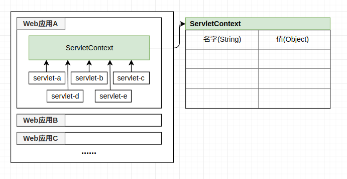

# 对Java中的Context上下文概念的理解
<!-- more -->
Java中Context是一个很常见的概念，在各大IOC容器和框架中经常可以看到，我第一次看到这个东西是servlet里的ServletContext对象，Context单词的本意是“语境”或者“上下文”，大部分技术博客也都直接拿上下文来称呼，但是从直观上让人感觉乖乖的，让人一时有点理解不能，这里针对Context的本质做一点讨论

#### Java中的几个Context例子

这里给出几个常见的Context，来感受一下这个上下文到底是个什么东西：

###### 1. JNDI的InitialContext类和Context接口

JNDI（Java Naming and Directory Interface），也就是Java命名和目录接口中的一个核心类javax.naming.InitialContext，它实现了一个javax.naming.Context接口，InitialContext类会读取JNDI的一些配置信息，并内含对象和其在JNDI中的注册名称的映射信息。这里给出javax.naming.Context接口的一段文档：

> This interface represents a naming context, which consists of a set of name-to-object bindings. It contains methods for examining and updating these bindings.
> 大致意思：这个接口代表了一个命名上下文，其包含了一系列的“名称到对象”映射的集合，同时携带了检查和更新这些绑定的相关方法

这里看一段JBOSS中获取MBean的远程调用类的代码：

```java
// 通过InitialContext中JNDI注册的名称“jmx/invoker/RMIAdaptor”来获得RMIAdaptor对象
InitialContext ic=new InitialContext();
RMIAdaptor server=(RMIAdaptor)ic.lookup("jmx/invoker/RMIAdaptor");
```
> 这里的行为类似一个Hash表，存储String->Object的映射关系

###### 2. Spring的ApplicationContext接口

ApplicationContext接口是Spring框架的核心接口之一，其代表的context也是Spring的核心概念之一，直接来看一段代码来体会一下：

```java
ApplicationContext context = new ClassPathXmlApplicationContext("ioc/Beans.xml");
HelloWorld helloWorld = (HelloWorld) context.getBean("helloWorld");
helloWorld.sayHello();
```
> 在本例中，ApplocationContext代表一个抽象概念，表示从xml中注册的元数据中加载出的一个“语境”，也就是标注了相互关系的元数集合

这段代码从配置文件Beans.xml中读取了各个Bean对象的元数据，返回了一个包含了所有注册Bean的context对象，我们可以从context中获取某个xml中注册的Bean对象，在这里，可以很清晰体会到，context的大致含义就是一个对象容器，或是一个运行环境

###### 3. J2EE的ServletContext接口

ServletContext是J2EE四大域之一，一个Web容器（比如Tomcat）可以运行多个Web应用（部署层面讲对应多个war包），Web容器在启动时，会为每个Web应用程序创建一个对应的ServletContext对象，代表当前Web应用，被所有访问者（客户端）共享

ServletContext对象会被其所属的Web应用（每个Web应用仅有一个ServletContext对象）中的所有Servlet共享，因此Servlet对象之间可以通过ServletContext对象来实现通讯，自此ServletContext对象通常也被称之为context域对象，具体关系可以看下图：



基本的使用代码，在ServletContext对象中写入一个共享数据（本应用的其它Servlet都可以访问）：
```java
ServletContext servletContext = getServletConfig().getServletContext();
servletContext.setAttribute("boy who lived", "harry potter");
```

#### 对Context的理解

关于context这个词，本意是”上下文“，”语境“和”前后关系“，在语言学中本来的作用是对抗歧义，防止”断章取义“，本质上是一组特定发生的对象及其之间相互关系的集合，如”在人造工具的帮助下，人类是这颗星球上最快的动物“，如果忽略上下文就容易造成断章取义的”人类是这颗星球上最快的动物“，表意上就没那么清晰了，在这种情况下，”上下文“的意思就是”语言的具体环境“

在ServletContext和如ApplicationContext的例子中，其名下的各个实例对象，是可以通过context来进行相互通信的，在这个情况下，context成为了某种承载了公用信息的公告板，是发生相互作用关系的媒介，这和context本意的”前后关系“是一致的。再比如访问JNDI的Context，他的上层是JNDI服务器（可能是远程的），下层是你的应用程序，他的作用也是建立一个通道让你能访问JNDI服务器，同时也让JNDI服务器接受你的请求，同样起到交互作用

从字面意义上看context翻译上下文其实没有任何问题，就是理解起来不太方便而已，在大多数场合下，如ApplicationContext，直接理解成一个”承上启下“的运行时环境或者对象容器即可，多数情况下一个Context实例也就是一个特殊关系集合，只管作为container使用即可

#### 总结

翻译的多样性是持续存在的，比如container这个词，可以作数据结构中的数据容器，docker的虚拟机容器，也可以是单纯的一堆对象的管理器，说到底只是个取名，只是一个抽象概念，应该关注其具体代表的职能，而不是纠结字眼，就比如”吐槽“这个词，论坛里都在用，要你说出具体意思估计回答千奇百怪的。如果一定要我取一个翻译，我会把把context翻译成”语境/前后关系容器/交互运行环境“。以上

#### 参考

[java上下文Context类](https://www.cnblogs.com/baoendemao/p/3804756.html)


