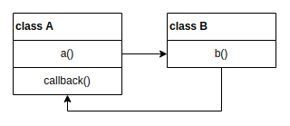
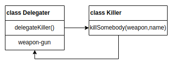

# JdbcTemplate源码解析初步

本文会从JdbcTemplate的使用开始，一步一步直到讲解完JdbcTemplate的核心流程，本文不是所谓的”文档型博客“，也不会讲解所有的类和接口，而是希望讲清楚核心流程，从而掌握JdbcTemplate的设计理念和设计模式，从而在工作中更好地掌握Jdbc和写出自己的JdbcUtils工具。文章包含有一下内容：

- JdbcTemplate的基本使用
- 构建Template的核心模式--模板模式
- JdbcTemplate的核心流程源码
- JdbcTemplate的几个组件类源码

> 本文有一点点长，请耐心阅读
<!-- more -->
#### 什么是JdbcTemplate

JdbcTemplate是Spring-Jdbc包下的一个主要操作类，Spring-Jdbc包则是Spring框架生态中专门用于封装Jdbc的一系列类和接口，但是在实际使用中，涉及数据库事务的操作必须配合Spring-tx包（用于事务管理）使用，一个完整的执行JdbcTemplate的maven依赖如下：
```xml
<dependencies>
    <!-- 事务管理 -->
    <dependency>
        <groupId>org.springframework</groupId>
        <artifactId>spring-tx</artifactId>
        <version>5.2.5.RELEASE</version>
    </dependency>
    <!-- JdbcTemplate -->
    <dependency>
        <groupId>org.springframework</groupId>
        <artifactId>spring-jdbc</artifactId>
        <version>5.2.5.RELEASE</version>
    </dependency>
</dependencies>
```
> 本文出现的所有代码均以5.2.5.RELEASE的版本为例
> 由于tx的完整使用使用需要aop，本文只讨论JdbcTemplate，其它博文中会讨论tx

#### 使用JdbcTemplate的几个例子

在开始研究源码之前，先看一下JdbcTemplate在调用方是怎么使用的，好对JdbcTemplate有一个大概的了解

###### 0. 开始之前

在本文的示例中，我们手动创建一个JdbcTemplate实例，在实际的Spring环境下，应当由IOC容器来提供。JdbcTemplate实例化的必要条件只有一个，那就是拥有一个DataSource实例：

```JAVA
public class JdbcTemplate extends JdbcAccessor implements JdbcOperations {
    // ...
    // 源码第164行至167行的携带数据源的构造器签名
    public JdbcTemplate(DataSource dataSource) {
        setDataSource(dataSource);
        afterPropertiesSet();
    }
    // ...
}
```

这里咱图省事，直接用C3P0来做数据库连接池，实现DataSource接口，C3P0的主类ComboPooledDataSource在实例化时若未制定配置文件会主动扫描classpath下的c3p0-config.xml，这里偷懒就直接让它默认扫描了：
```xml
<?xml version="1.0" encoding="UTF-8"?>
<!-- 一个简化版的c3p0-config.xml -->
<c3p0-config>
    <default-config>
        <!-- 连接四大参数配置 -->
        <property name="jdbcUrl">jdbc:mysql://127.0.0.1:3306/jdbc?useSSL=false&amp;useUnicode=true&amp;characterEncoding=utf-8&amp;serverTimezone=UTC</property>
        <property name="driverClass">com.mysql.cj.jdbc.Driver</property>
        <property name="user">root</property>
        <property name="password">root</property>
        <!-- 池参数配置 -->
        <property name="acquireIncrement">3</property>
        <property name="initialPoolSize">10</property>
        <property name="minPoolSize">2</property>
        <property name="maxPoolSize">10</property>
    </default-config>
</c3p0-config>
```
然后调用一下代码，就可以快速获得一个JdbcTemplate实例了，ComboPooledDataSource会自动扫描classpath下的c3p0-config.xml并实例化一个DataSource给JdbcTemplate：
```java
public class TestTemplate {
    private static void testJdbc() {
        JdbcTemplate jdbcTemplate = new JdbcTemplate(new ComboPooledDataSource());
        // ...
    }
}
```
###### 1. 使用update()修改数据

和Jdbc中的executeUpdate()方法一样，JdbcTemplate的update()方法可用于 增/删/改，且返回值为影响了的数据库的行数：
```java
JdbcTemplate jdbcTemplate = new JdbcTemplate(new ComboPooledDataSource());
String sql = "update t_user set password = ? where uid = ?";
int count = jdbcTemplate.update(sql, "default", 10001);
System.out.println("has updated " + count + " rows");
```

###### 2. 使用query()查询行，并映射哈希组

使用使用query()查询行，并指定一个映射规则RowMapper，将二位表的结果映射到List<Map<String, Object>>的数据容器对象中：

```java
// 无参数版本
String sql = "select * from t_user";
RowMapper<Map<String, Object>> rowMapper = new ColumnMapRowMapper();
List<Map<String, Object>> rows = jdbcTemplate.query(sql, rowMapper);
// 有参数版本
sql = "select * from t_user where uid > ? and uid < ?";
RowMapper<Map<String, Object>> rowMapper = new ColumnMapRowMapper();
List<Map<String, Object>> rows = jdbcTemplate.query(sql, rowMapper, 10001, 10010);
```
不手动指定映射规则，而采用JdbcTemplate封装好的queryForList()方法，结果和上面使用RowMapper的代码是一致的：
```java
String sql = "select * from t_user where uid > ? and uid < ?";
List<Map<String, Object>> rows = jdbcTemplate.queryForList(sql, 10001, 10010);
```
> 后面我们会看见这两个方法其实是一样的

###### 3. 使用query()查询行，并映射实体类

JdbcTemplate提供了3种映射规则，除了上文映射哈希组的ColumnMapRowMapper，还有SingleColumnRowMapper和BeanPropertyRowMapper，使用前者可以映射类似count(*)这样的单行，后者则可以将结果集映射到一个实体类上面，非常方便：
```java
// 映射单行
String sql = "select uid from t_user where uid > ? and uid < ?";
RowMapper<Integer> rowMapper = new SingleColumnRowMapper(Integer.class);
List<Integer> uids = jdbcTemplate.query(sql,rowMapper, 10001,10010);
// 映射实体
String sql = "select * from t_user where uid > ? and uid < ?";
RowMapper<User> rowMapper = new BeanPropertyRowMapper<User>(User.class);
List<User> users = jdbcTemplate.query(sql,rowMapper, 10001,10010);
```
> 使用BeanPropertyRowMapper，表字段命名需跟实体类属性一致，或者是下划线对应驼峰

通过以上3个基本例子，对JdbcTemplate的使用已经有了基本的了解，流程也很固定，手写sql，丢进JdbcTemplate提供的查询方法，并获取一个处理过的结果。对我来说，JdbcTemplate给我的第一感觉，就是个执行器+映射器，总体特征有点像Mybatis的Executor，后来读了源码，发现也确实如此

#### 模板模式

在我们真正掀开JdbcTemplate的裙子，看看里面有什么大宝贝前，还需要了解一个行为型设计模式，模板模式。JdbcTemplate就是基于模板模式做到的抽象和层次剥离

###### 1. 15分钟模板模式火箭式入门

一句话解释就是“老爹画图的线条，儿子填色，最终变成一副完整的画”。OOP的基本释义为，为子类设计一个模板，以便在子类中可以复用这些方法。完整定义如下：
                                 
> 定义一个操作中的算法的框架，由父类控制着算法的主要流程，而将一些步骤延迟到子类中。使得子类可以不改变一个算法的结构即可重定义该算法的某些特定步骤
> 总言之，父类始终控制着整个流程的主动权，子类只是辅助（或者说配合）父类实现某些可定制的步骤

模板模式的常见实现有2种：

- 基于抽象类的实现
- 基于回调的实现
> 本质依旧是Java的面向接口编程和约定式编程

###### 1. 基于抽象类的模板模式
在抽象类中定义一个算法流程，将部分细节封装成抽象方法，强制子类实现，从而实现不同情况不同实现：
```java
// 抽象模板
public abstract class AbstractTemplate {
    // 模板方法
    public void templateMethod() {
        //（所有）基本方法，在这里构成了模板方法的主体逻辑（主体执行算法）
        // 基本方法根据职能也可以有不同的分类，常见有抽象方法，钩子方法（插件，比如引入一个日志钩子）和具体方法
        abstractMethod();
        hookMethod();
        concreteMethod();
    }
    // 抽象方法，必须有子类实现
    protected abstract void abstractMethod();
    // 钩子方法，子类可以选择重写或不重写
    protected void hookMethod() {
    }
    // 具体方法，通常携带final关键字，子类不可修改
    private final void concreteMethod() {
        System.out.println("抽象类中的具体方法");
    }
}
// 由子类实现所有的抽象方法，使得类完整可执行
// A实现
public class ConcreteTemplateA extends AbstractTemplate {
    protected void abstractMethod() {
        System.out.println("A 子类中重写的抽象方法");
    }
}
// B实现
public class ConcreteTemplateB extends AbstractTemplate {
    protected void abstractMethod() {
        System.out.println("B 子类中重写的抽象方法");
    }
}
// 测试用例
public class Client {
    public static void main(String[] args) {
        AbstractTemplate tp = new ConcreteTemplateA();
        // 调用子类 A 的模板方法
        tp.templateMethod();
        tp = new ConcreteTemplateB();
        // 调用子类 B 的模板方法
        tp.templateMethod();
    }
}
```
###### 2. 基于回调的模板模式

之前基于抽象类的木板模式固然不错，但是有一个问题，当父类中出现了10个抽象方法时，子类就必须把这10个方法全部实现，但是子类所需要运行的那部分逻辑可能之需要其中3个方法，那这就造成了浪费，所以就出现了新的实现，基于回调的实现，在父类中定义若干个接口，子类按需进行实现，在调用时把自己实现的回调对象注入回父类，完成模板模式的细节填充

- 一个典型的回调过程：



什么是回调函数，简单来说，就是A类定义了a()和callback()，并在a()中调用了B类的b()方法，但是b()方法在执行时反过来调用了A.a()，这种模式类似委托人，你（A类）将自己买的枪（callback方法）交给了一名职业杀手（B类），并委托（执行a方法）杀手杀人（执行b方法），而且杀手为了不暴露自己，用的是你的枪（callback方法，由A.a()中的调用参数注入给B.b()）,杀手只执行自己的业务（杀人，也就是b()）。在这个案例中，你作为委托人是具体的（具体子类），拥有真实资源（枪）和发起委托的权利，而杀手是抽象的（抽象父类），只要准备了杀手要求提供的武器，谁都能去委托他杀人（b()方法，杀人业务），但他用的其实是你的枪。在回调过程中，callback的拥有者是A，但执行者是B，A调用了B，却被B反过来调用了A的资源，这个过程称回调

- 委托杀手杀人的回调过程：



```java
// 武器接口
public interface Weapon {
    void kill(String name);
}
// 委托人
public class Delegater {
    // 买了一把枪
    Weapon gun = new Weapon() {
        public void kill(String name) {
            System.out.println("一枪打死了" + name);
        }
    };
    // 把枪交给杀手，委托杀手杀人
    void delegateKiller() {
        new Killer().killSomebody(gun, "你的项目经理");
    }
}
// 杀手
public class Killer {
    // 杀手的抽象业务，按照委托人给的武器和名单杀人
    public void killSomebody(Weapon weapon, String name) {
        System.out.print("杀手");
        weapon.kill(name);
    }
}
// 测试类
public class Client {
    public static void main(String[] args) {
        new Delegater().delegateKiller();
        // 输出：杀手一枪打死了你的项目经理
    }
}
```
> 在这个例子中，杀手就是抽象父类，委托人就是具体子类，通过回调过程，自然而然地实现了模板模式
###### 3. JdbcTemplate为什么采用基于回调的模板模式

- 为什么要用模板模式
这是一段传统且完整的Jdbc代码：
```java
public class TestJdbc {
    // 定义常量
    private static String DriverClassName = "com.mysql.cj.jdbc.Driver";
    private static String Url = "jdbc:mysql://127.0.0.1:3306/jdbc?useSSL=false&useUnicode=true&characterEncoding=utf-8&serverTimezone=UTC&allowPublicKeyRetrieval=true";
    private static String username = "root";
    private static String password = "root";

    public static void main(String[] args) {

        Connection connection = null;
        PreparedStatement preparedStatement = null;
        ResultSet resultSet = null;
        String sql = "select * from t_user where uid > ?";

        try {
            // 1.注册数据库驱动
            Class.forName(DriverClassName);
            // 2.获取连接
            connection = DriverManager.getConnection(Url, username, password);
            // 3.控制事务
            connection.setAutoCommit(false);
            // 4.准备语句，绑定参数
            preparedStatement = connection.prepareStatement(sql);
            preparedStatement.setInt(1, 100);
            // 5.解析结果集，映射对象或封装map
            resultSet = preparedStatement.executeQuery();
            while (resultSet.next()) {
                System.out.print("the uid is: "+resultSet.getObject(1));
            }
        } catch (ClassNotFoundException e) {
            // 6.异常处理
            e.printStackTrace();
        } catch (SQLException e) {
            e.printStackTrace();
        } finally {
            // 7.关闭废弃连接
            try {
                if (resultSet != null) {
                    resultSet.close();
                }
                if (preparedStatement != null) {
                    preparedStatement.close();
                }
                if (connection != null) {
                    connection.close();
                }
            } catch (SQLException e) {
                e.printStackTrace();
            }
        }
    }
}
```
在这个代码中，一共有7个主要步骤，但是只有4的准备语句和5的解析结果集是不一样的，其它步骤在另一个Jdbc代码中是重复，这就很明显了，可以制作一个Jdbc父类模板，由模板控制获取连接和异常处理一类的代码，剩下由子类提交自己的语句和结果映射规则，做到代码复用，调试起来也更加方便，这个就是JdbcTemplate的核心思想

- 为什么要用回调实现模板模式

前文提过了，是为了规避抽象类中抽象方法过多的问题

#### JdbcTemplate核心流程源码

在看了前文这么多废话后，终于开始源码部分了，达瓦里西完全可以自己打开ide去看，idea中Ctrl+B就可以回溯代码

###### 1. JdbcTemplate几个核心签名

JdbcTemplate和我们通常用的静态JdbcUtils不一样，它是一个类，可以被实例化：
```java
// 这是一个常见的核心类构造过程：接口（定义所有的核心方法）->抽象类（实现大部分的工具方法）->类（完整实现）
public class JdbcTemplate extends JdbcAccessor implements JdbcOperations {
    public JdbcTemplate() {}
    // 前文提过，构造JdbcTemplate实例必须有DataSource
    public JdbcTemplate(DataSource dataSource) {
        // setDataSource()是在JdbcAccessor中实现的，用于将ds绑定到一个本地变量上
        setDataSource(dataSource);
        // setDataSource()也由JdbcAccessor实现，作用是校验datasource是否已经绑定，如果null则抛IllegalArgumentException
		afterPropertiesSet();
	}
	public JdbcTemplate(DataSource dataSource, boolean lazyInit) {
		setDataSource(dataSource);
		setLazyInit(lazyInit);
		afterPropertiesSet();
	}
}
```

#### 施工ing


