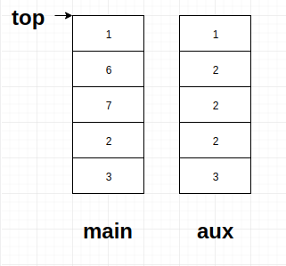
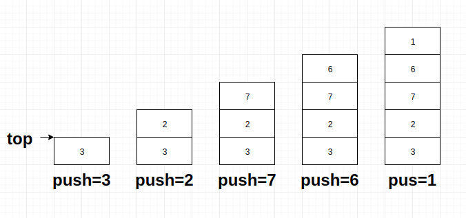
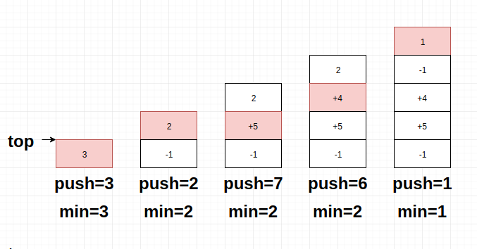
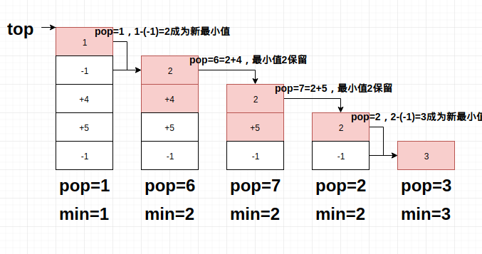
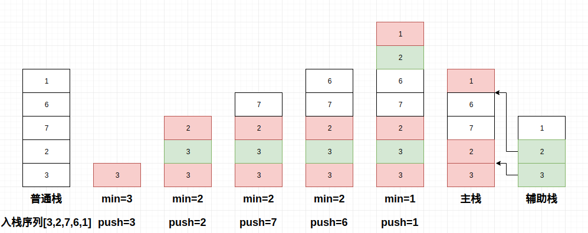
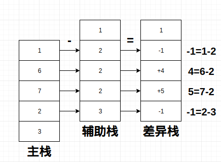

# 经典算法题解-最小值栈

> 题目来源：最早是在念高中时看见这个题目的，具体来源已经不晓得了，网上流传了很多版本
> 题目难度：简单

<!-- more -->

#### 问题描述

问题很简单就一句话，实现一个带有最小值min()方法的栈，且要求耗时O(1)

#### 问题分析

我是在高二暑假的一个训练营第一次看到这个问题的，这个问题属于那种“只有想不到，想到了就很容易”的问题。我当时拿到问题的第一个想法，就是在栈上设置一个min_value属性，但是很快问题就来了，如果这个min_value被栈pop了，这个属性就失效了，所以不可以单纯使用一个属性去记录。同样的问题要求时复为O(1)，所以也不可能将栈整个翻出来再找最小值

虽然设置属性不可行，但是重点已经出来了，对于栈这种单端数据操作的数据结构，需要设置一个记录型结构，存储每个状态下的min_value才行，比如栈内数据\[2,7,6,3,1]的min=1，pop一次尾部后有\[2,7,6,3]的min=2，这里其实自然而然想到辅助栈（栈本身就是一个记录型结构），在此给出方案A

###### 1. 辅助栈

直接上图，对于入栈队列\[3,2,7,6,1\]，左侧为主栈，右侧为辅助栈，栈顶在上：



完整的元素变化流程如下：


观察右侧的辅助栈，其中每个元素都是对应左侧主栈中同层次->栈底的元素中的最小值，对主栈的读写会影响辅助栈的读写：

1. 主栈push一个新元素a，辅助站将a与当前min比较，如a<min，则辅助栈push a，否则辅助栈push min
2. 主栈pop一个元素b，辅助栈跟随主栈，无条件pop一个元素c
3. 辅助栈当前的栈顶元素就是主栈当前的最小值

Java的实例代码如下：
```java
class AuxedStack {
    // 分别设置主栈和辅助栈
    private Stack<Integer> main;
    private Stack<Integer> aux;

    public AuxedStack() {
        main = new Stack<>();
        aux = new Stack<>();
    }

    // 和当前最小值比较，若小则辅助栈push新值，否则复制一次当前最小值
    public void push(Integer i) {
        main.push(i);
        if (aux.isEmpty() || i < aux.peek()) {
            aux.push(i);
        } else {
            aux.push(aux.peek());
        }
    }
    // pop时主辅栈一起弹出
    public Integer pop() {
        aux.pop();
        return main.pop();
    }
    // 辅助栈的顶元素就是当前最小值
    public Integer min() {
        return aux.peek();
    }
    
    // 其它的一些基本方法
    public Integer peek() {
        return main.peek();
    }
    boolean isEmpty() {
        return main.isEmpty();
    }
    int size() {
        return main.size();
    }
}
```
> 这里我图省事，就直接封装了JDK提供的Stack类
> 辅助栈其实还有优化空间，比如在本例给出的入栈序列\[3,2,7,6,1\]中，辅助栈为\[1,2,2,2,3]，其中的2出现了3次，是可以压缩的，这里为了清楚展示代码没有这么处理
> 使用辅助栈的时间复杂度O(1)，空间为O(N)

###### 2. 差异栈

辅助栈是一种不错的方案，但是会占据额外空间，似乎不是让人很满意，所以使用差异栈就成了另一种方案，差异栈在使用上不占额外空间。让我们把目光放回题目上，题目要求的是返回栈的最小值，且要求时耗是O(1)，其实这里很容易和栈本身的性质联系起来，栈顶元素的读写本身就是O(1)啊，所以出现了一个疑问，有没有什么方法可以把每个阶段的最小值放当时的栈顶？

在这里介绍一下差异栈（下图右侧），在普通栈（下图左侧）中，每个节点存储的都是原始数据，但是差异栈在存储数据时会有额外处理，栈顶之外的元素存储的不是原始数据，而是和当时的栈顶元素的差值：


差异栈这种结构一开始只是为了方便记录地图上坐标之间的差值而设计的，结果后来发现了很多其它的作用，比如差异栈在本题中稍作变形即可，具体方案如下：

1. 设置一个差异栈
2. 允许同时操作栈的前两位
3. 差异栈顶保存最小元素
4. push一个新元素，如果比当前栈顶元素小，则新元素成为新栈顶，原栈顶计算差值，成为第二元素；如果比当前栈顶大，则直接计算差值下压至第二位
5. pop时，直接越过栈顶元素看第二元素，如果第二元素小于零，说明本次pop的是最小元素（也就是栈顶元素本身），弹出栈顶元素，并还原差值，第二元素成为新栈顶；如果大于零，说明本次pop的是一个普通数值，还原差值后，直接弹出第二元素，栈顶保持不变（当前栈最小值不变）

依旧是入栈序列\[3,2,7,6,1\]，普通情况下的栈元素变化如下：



使用差异栈push情况下的栈元素变化（红色为新元素）：



使用差异栈pop情况下的栈元素变化（红色为出栈**数据**，比如在pop=6时，通过栈顶元素2+第二元素4，还原出原值6并弹出，然后最小值2不变，依旧在栈顶）：



这里给出相关的C++实现代码（比我用Java写的更清楚），如下：

```cpp
#include <iostream>
#include <queue>
#include <climits>
#include <algorithm>
#include <memory.h>
#include <stdio.h>
#include <ostream>
#include <vector>
#include <list>
#include <cmath>
#include <string>
#include <stdexcept>
#include <stack>
using namespace std;

template<typename T>
class minStack
{
public:
    T pop();
    void push(const T& elem);
    T min();
    stack<T> s;
};
template<typename T>
void minStack<T>::push(const T&elem)
{
    if(s.empty())
    {
        s.push(elem);
        return;
    }
    T minval = s.top();
    s.pop();
    s.push(elem-minval);
    if(elem < minval)
    {
        s.push(elem);
    }
    else
        s.push(minval);
    return;
}

template<typename T>
T minStack<T>::pop()
{
    if(s.empty())
        throw std::out_of_range("stack is empty");
    T minval = s.top();
    s.pop();
    T val = s.top();
    s.pop();
    if(val <= 0)
    {
        s.push(minval - val);
        val = minval;
    }
    else
    {
        s.push(minval);
        val = minval+val;
    }
    return val;
}

int main()
{
    return 0;
}
```
> 如果想看Java实例的在评论区戳我
> 使用差异栈不占用任何额外空间

#### 一点碎碎念


这个是leetcode上一个老兄写的，原文在此[单变量标记当前最小元素解题](https://leetcode-cn.com/problems/min-stack-lcci/solution/dan-bian-liang-biao-ji-dang-qian-zui-xiao-yuan-su-/)，代码我就不贴了，原文链接里有，如果我没理解错的话，这个方案出来的图如下：



看完这个图基本就可以理解了，这种方案就是就是把压缩过长度的辅助栈融合到了主栈里，可以看到我在最右侧画的示意图，其实这就是一种变形了的双栈结构

#### 两点碎碎念

在第一次接触差异栈的时候会觉得很奇怪，疑惑为什么要这么写，其实只要自己实现一次，就能很轻松理解其中的关系，差异值不是单纯的一个差值，它其实还表示了当前元素和栈顶元素（栈最小值的关系），这种关系的来源其实是上文辅助栈那张完整流程图中蓝色部分，也就是最小值滞留的体现，在未遇到比当前值还小的数值时，最小值是不变的，所以可以单纯用一个差值正负性来区别

下图是我们前文用过的双栈结构，其中左侧为主栈，主栈的每个栈元素就是数据本身，也就是每个栈元素只携带了一个信息（原始数值），但是对于差异栈来说，其中的每个栈元素也是一个数值，但其实携带了两个信息（原始数值和该数值与最小值的**关系**），所以我们可以用一个栈表示双栈法中需要两个栈才能表达的信息

这是双栈法：


这里对双栈结构加一点东西，看完这个图，各位应该心里有数了，差异栈是一个主从复合栈，本身在结构上，就同时拥有了主栈和辅助栈上存在的两类信息：



#### 总结

时刻记住栈是一种记录型结构，以及差异栈这种特殊的栈变种，有时候可以在特定问题中发挥作用

如果你发现了bug，或者有自己的想法，请给博主发邮件，或者在评论区戳我，感谢阅读(′▽`〃)

#### 参考

[面试金典--MIN栈的实现](https://www.cnblogs.com/cane/p/3793510.html)
